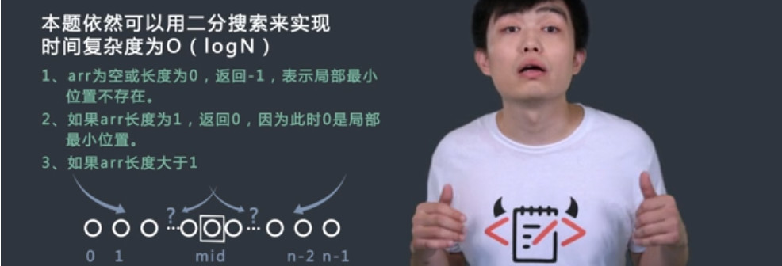
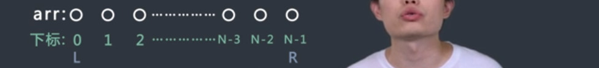
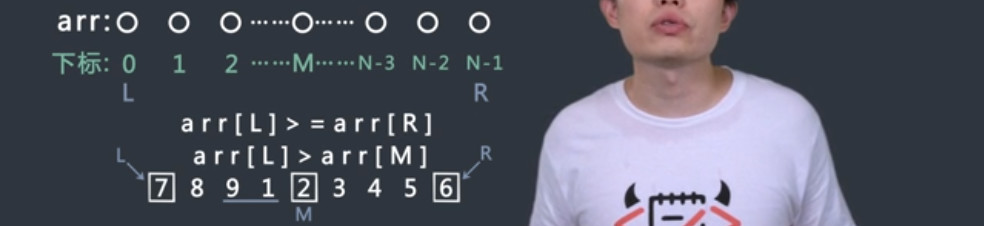
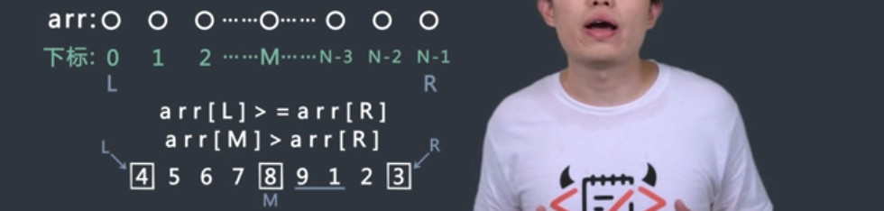
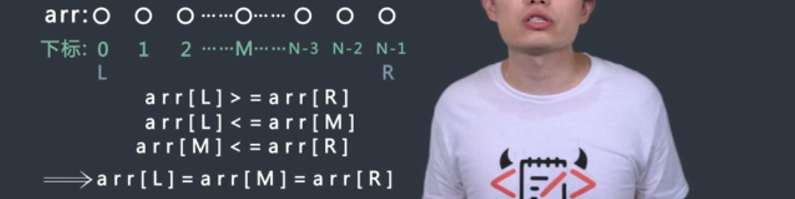

# 二分搜索（一）习题
## 局部最小位置
`题目`
定义局部最小的概念。arr长度为1时，arr[0]是局部最小。arr的长度为N(N>1)时，如果arr[0]<arr[1]，那么arr[0]是局部最小；如果arr[N-1]<arr[N-2]，那么arr[N-1]是局部最小；如果0<i<N-1，既有arr[i]<arr[i-1]又有arr[i]<arr[i+1]，那么arr[i]是局部最小。 给定无序数组arr，已知arr中任意两个相邻的数都不相等，写一个函数，只需返回arr中任意一个局部最小出现的位置即可。

<!--more-->

`过程`
- arr长度为1时，arr[0]是局部最小。arr的长度为N(N>1)时，如果arr[0]<arr[1]，那么arr[0]是局部最小；如果arr[N-1]<arr[N-2]，那么arr[N-1]是局部最小；
- 如果arr[mid]>arr[mid-1]，right = mid - 1；如果arr[mid] > arr[mid+1]，left = mid + 1;


`代码`
```c++
class Solution {
public:
    int getLessIndex(vector<int> arr) {
        int len = arr.size();
        if(arr.size() == 0)return -1;
        if(arr.size() == 1)return 0;
        if(arr[0] < arr[1])
            return 0;
        if(arr[len - 1] < arr[len - 2])
            return len-1;

        int left = 1;
        int right = len-2;
        int mid = 0;
        while(left < right){
            mid = left + (right-left)/2;
            if(arr[mid]>arr[mid-1]){
                right = mid - 1;
            }else if(arr[mid] > arr[mid+1]){
                left = mid + 1;
            }else
                return mid;
        }
        return left;
    }
};
```

## 元素最左出现位置
`题目`
对于一个有序数组arr，再给定一个整数num，请在arr中找到num这个数出现的最左边的位置。
给定一个数组arr及它的大小n，同时给定num。请返回所求位置。若该元素在数组中未出现，请返回-1。
>[1,2,3,3,4],5,3
>返回：2

`过程`
- 定义一个res=-1，使用二分搜索，如果找到num=arr[mid]，更新res=mid，right=mid-1；
- 继续二分搜索，最后返回res；


`代码`
```c++
class LeftMostAppearance {
public:
    int findPos(vector<int> arr, int n, int num) {
        // write code here
        int left = 0;
        int right = n-1;
        int mid = 0;
        int res = -1;
        while(left <= right){
            mid = left + (right-left)/2;
            if(arr[mid]>num)right = mid - 1;
            else if(arr[mid]<num)left = mid + 1;
            else {
                res = mid;
                right = mid - 1;
            }
        }
        return res;
    }
};
```

## 循环有序数组最小值
`题目`
对于一个有序循环数组arr，返回arr中的最小值。有序循环数组是指，有序数组左边任意长度的部分放到右边去，右边的部分拿到左边来。比如数组[1,2,3,3,4]，是有序循环数组，[4,1,2,3,3]也是。
给定数组arr及它的大小n，请返回最小值。

>[4,1,2,3,3],5
>返回：1

`过程`

- 如果arr[L]<arr[R]，说明数组本来就是有序的，直接返回arr[L]；
- 如果arr[L]>=arr[R]，说明数组循环移动了；





`代码`
```c++
class MinValue {
public:
    int getMin(vector<int> arr, int n) {
        // write code here
        int left = 0;
        int right = n-1;
        int mid = 0;
        while(left < right){
            if(left == right -1)
                break;
            if(arr[left]<arr[right])return arr[left];
            mid = (left + right)/2;
            if(arr[left]>arr[mid]){
                right = mid;
                continue;
            }
            if(arr[mid]>arr[right]){
                left = mid;
                continue;
            }
            while(left < mid){
                if(arr[left]==arr[mid])left++;
                else if(arr[left]<arr[mid])return arr[left];
                else {
                    right = mid;
                    break;
                }
            }
        }
        if(arr[left]<arr[right])return arr[left];
        else return arr[right];
    }
};
```

## 最左原位
`题目`
有一个有序数组arr，其中不含有重复元素，请找到满足arr[i]==i条件的最左的位置。如果所有位置上的数都不满足条件，返回-1。
给定有序数组arr及它的大小n，请返回所求值。

`过程`
- if(arr[0]>0) 表示位置往后的没有原位匹配；if(arr[n-1]<n-1) 数组没有原位匹配；
- if(arr[left]>left || arr[right]<right)  说明 在目前的区间内没有原位匹配；
- if(arr[mid]<mid) 原位在右边，left=mid+1；
- if(arr[mid]>mid) 原位在左边，right=mid-1；
- 否则res=mid，因为要找最左原位，所以，right=mid-1；


`代码`
```c++
class Find {
public:
    int findPos(vector<int> arr, int n) {
        // write code here
        if(arr[0]>0)return -1;
        if(arr[n-1]<n-1)return -1;
        int left = 0;
        int right = n-1;
        int mid = 0;
        int res = -1;
        while(left <= right){
            if(arr[left]>left || arr[right]<right)break;
            mid = (left+right)/2;
            if(arr[mid]<mid)left = mid+1;
            else if(arr[mid]>mid)right = mid-1;
            else {
                res = mid;
                right = mid-1;
            }
        }
        return res;
    }
};
```
## 完全二叉树计数
`题目`
给定一棵完全二叉树的根节点root，返回这棵树的节点个数。如果完全二叉树的节点数为N，请实现时间复杂度低于O(N)的解法。
给定树的根结点root，请返回树的大小。
`过程`


`代码`
```c++
/*
struct TreeNode {
    int val;
    struct TreeNode *left;
    struct TreeNode *right;
    TreeNode(int x) :
            val(x), left(NULL), right(NULL) {
    }
};*/

class CountNodes {
public:
    int count(TreeNode* root) {
        // write code here
    }
};
```
## 快速N次方
`题目`
如果更快的求一个整数k的n次方。如果两个整数相乘并得到结果的时间复杂度为O(1)，得到整数k的N次方的过程请实现时间复杂度为O(logN)的方法。
给定k和n，请返回k的n次方，为了防止溢出，请返回结果Mod 1000000007的值。
>2,3
>返回：8

`过程`
- 取出幂次，依次取出二进制的最后一位，如果最后一位为0，则不进行累乘，如果最后一位不为0，则进行累乘；
- 每一次取出一位，要进行原数的平方。

`代码`
```c++
class QuickPower {
public:
    int getPower(int k, int N) {
        // write code here
        if(N==0)return 0;
        long temp = k;
        long res=1;
        for(int i = N;i > 0; i>>=1){
            if(i&1!=0){
                res = res * temp;
            }
            temp = (temp*temp) % 1000000007;
            res = res % 1000000007;
        }
        return int(res);
    }
};
```