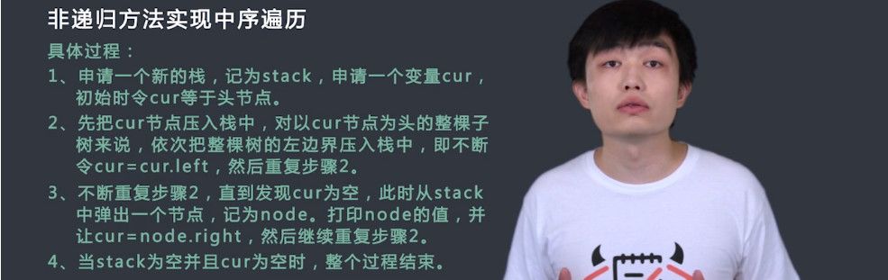
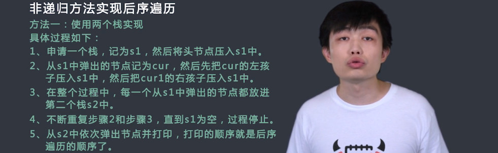
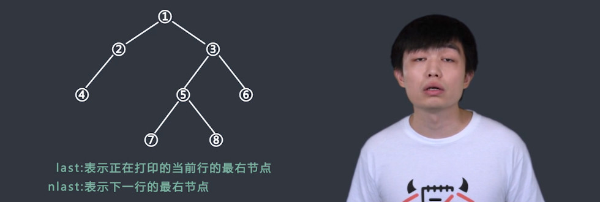

# 二叉树（一）

## 递归实现二叉树遍历
`题目`
请用递归方式实现二叉树的先序、中序和后序的遍历打印。
给定一个二叉树的根结点root，请依次返回二叉树的先序，中序和后续遍历(二维数组的形式)。

<!--more-->

`过程`
无

`代码`
```c++
/*
struct TreeNode {
    int val;
    struct TreeNode *left;
    struct TreeNode *right;
    TreeNode(int x) :
            val(x), left(NULL), right(NULL) {
    }
};*/

class TreeToSequence {
public:
    vector<vector<int> > convert(TreeNode* root) {
        // write code here
        vector<vector<int>> ret;
        TreeNode *pnode;
        pnode = root;
        preorder(pnode);
        pnode = root;
        inorder(pnode);
        pnode = root;
        lastorder(pnode);
        ret.push_back(pot);
        ret.push_back(iot);
        ret.push_back(lot);
        return ret;
    }
    vector<int> pot,iot,lot;
    void preorder(TreeNode* root)
    {
        if(root == NULL)
            return;
        pot.push_back(root->val);
        preorder(root->left);
        preorder(root->right);
    }
    void inorder(TreeNode* root)
    {
        if(root == NULL)
            return;
        inorder(root->left);
        iot.push_back(root->val);
        inorder(root->right);
    }
    void lastorder(TreeNode* root)
    {
        if(root == NULL)
            return;
        lastorder(root->left);
        lastorder(root->right);
        lot.push_back(root->val);
    }
};
```
## 非递归实现二叉树遍历
`题目`
请用非递归方式实现二叉树的先序、中序和后序的遍历打印。
给定一个二叉树的根结点root，请依次返回二叉树的先序，中序和后续遍历(二维数组的形式)。

`过程`




`代码`
```c++
/*
struct TreeNode {
    int val;
    struct TreeNode *left;
    struct TreeNode *right;
    TreeNode(int x) :
            val(x), left(NULL), right(NULL) {
    }
};*/

class TreeToSequence {
public:
    vector<vector<int> > convert(TreeNode* root) {
        // write code here
        vector<vector<int>> ret;
        TreeNode *pnode;
        pnode = root;
        preorder(pnode);
        pnode = root;
        inorder(pnode);
        pnode = root;
        lastorder(pnode);
        ret.push_back(pot);
        ret.push_back(iot);
        ret.push_back(lot);
        return ret;
    }
    vector<int> pot,iot,lot;
    void preorder(TreeNode* root)
    {
        stack<TreeNode*> stk;
        stk.push(root);
        while(!stk.empty())
        {
            TreeNode* pnode = stk.top();
            pot.push_back(pnode->val);
            stk.pop();
            if(pnode->right != NULL)
                stk.push(pnode->right);
            if(pnode->left != NULL)
                stk.push(pnode->left);
        }
    }
    void inorder(TreeNode* root)
    {
        stack<TreeNode*> stk;
        while(!stk.empty() || root != NULL)
        {
            if(root != NULL){
                stk.push(root);
                root = root->left;
            }
            else{
                TreeNode* pnode = stk.top();
                iot.push_back(pnode->val);
                stk.pop();
                root = pnode->right;
            }
        }
    }
    void lastorder(TreeNode* root)
    {
        stack<TreeNode*> stk1;
        stack<TreeNode*> stk2;
        stk1.push(root);
        while(!stk1.empty())
        {
            TreeNode* pnode = stk1.top();
            stk2.push(pnode);
            stk1.pop();
            if(pnode->left != NULL)
                stk1.push(pnode->left);
            if(pnode->right != NULL)
                stk1.push(pnode->right);
        }
        while(!stk2.empty()){
            lot.push_back(stk2.top()->val);
            stk2.pop();
        }
    }
};
```
# 二叉树（二）

## 二叉树打印练习题
`题目`
有一棵二叉树，请设计一个算法，按照层次打印这棵二叉树。
给定二叉树的根结点root，请返回打印结果，结果按照每一层一个数组进行储存，所有数组的顺序按照层数从上往下，且每一层的数组内元素按照从左往右排列。保证结点数小于等于500。

`过程`


`代码`
```c++
/*
struct TreeNode {
    int val;
    struct TreeNode *left;
    struct TreeNode *right;
    TreeNode(int x) :
            val(x), left(NULL), right(NULL) {
    }
};*/

class TreePrinter {
public:
    vector<vector<int> > printTree(TreeNode* root) {
        // write code here
        vector<vector<int>> ret;
        if(root==nullptr)return ret;
        queue<TreeNode *> Q;
        vector<int> temp_ret;
        TreeNode *last = root;
        TreeNode *nlast = NULL;
        Q.push(root);
        while(!Q.empty()){
            TreeNode* temp = Q.front();
            Q.pop();
            temp_ret.push_back(temp->val);
            if(temp->left){
                Q.push(temp->left);
                nlast = temp->left;
            }
            if(temp->right){
                Q.push(temp->right);
                nlast = temp->right;
            }
            if(temp==last){
                ret.push_back(temp_ret);
                last=nlast;
                temp_ret.clear();
            }
        }
        return ret;
    }
};
```

## 二叉树序列化
`题目`
首先我们介绍二叉树先序序列化的方式，假设序列化的结果字符串为str，初始时str等于空字符串。先序遍历二叉树，如果遇到空节点，就在str的末尾加上“#!”，“#”表示这个节点为空，节点值不存在，当然你也可以用其他的特殊字符，“!”表示一个值的结束。如果遇到不为空的节点，假设节点值为3，就在str的末尾加上“3!”。现在请你实现树的先序序列化。
给定树的根结点root，请返回二叉树序列化后的字符串。

`过程`


`代码`
```c++
/*
struct TreeNode {
    int val;
    struct TreeNode *left;
    struct TreeNode *right;
    TreeNode(int x) :
            val(x), left(NULL), right(NULL) {
    }
};*/

class TreeToString {
public:
    string toString(TreeNode* root) {
        // write code here
        string str;
        preorder(root, str);
        return str;
    }
    void preorder(TreeNode* root, string &str)
    {
        if(root == NULL){
            str+="#!";
            return;
        }
        str+=to_string(root->val) + '!';
        preorder(root->left, str);
        preorder(root->right, str);
    }
};
```
