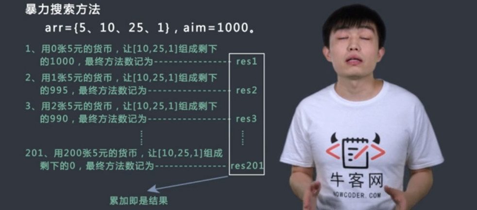
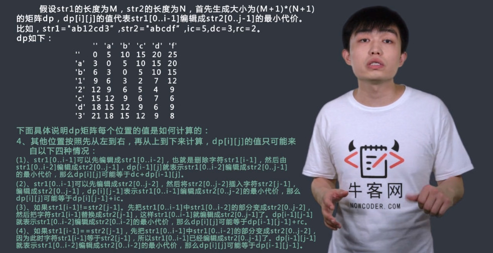

# 动态规划（一） 习题

## 找零钱练习题
`题目`
有数组penny，penny中所有的值都为正数且不重复。每个值代表一种面值的货币，每种面值的货币可以使用任意张，再给定一个整数aim(小于等于1000)代表要找的钱数，求换钱有多少种方法。
给定数组penny及它的大小(小于等于50)，同时给定一个整数aim，请返回有多少种方法可以凑成aim。

<!--more-->

>[1,2,4],3,3
>返回：2

`过程`

### 方法一：



### 方法二：

方法三：


`代码`
```c++
class Exchange {
public:
    int countWays(vector<int> penny, int n, int aim) {
        // write code here
        vector<vector<int>> dp(n, vector<int>(aim+1, 0));
        for(int i = 0; i < n; ++i){
            dp[i][0] = 1;
        }
        for(int i = 0; i < aim+1; ++i){
            if(i % penny[0] == 0){
                dp[0][i] = 1;
            }
        }
        for(int i = 1; i < n; i++){
            for(int j = 1; j < aim+1; j++){
                if(j - penny[i] >= 0){
                    dp[i][j] = dp[i-1][j] + dp[i][j- penny[i]];
                }
                else {
                    dp[i][j] = dp[i-1][j];
                }
            }
        }
        return dp[n-1][aim];
    }
};
```
# 动态规划（二） 习题

## 台阶问题练习题
`题目`
有n级台阶，一个人每次上一级或者两级，问有多少种走完n级台阶的方法。为了防止溢出，请将结果Mod 1000000007
给定一个正整数int n，请返回一个数，代表上楼的方式数。保证n小于等于100000。

>1
>返回：1

`过程`


`代码`
```c++
class GoUpstairs {
public:
    int countWays1(int n) {
        // write code here
        if(n < 1)
            return 0;
        if(n == 1 || n == 2)
            return n;
        return countWays1(n-1)%1000000007 + countWays1(n-2)%1000000007;
    }
    int countWays(int n) {
        // write code here
        if(n == 0)return 0;
        if(n == 1 || n == 2)
            return n;
        int ret[n+1];
        ret[0] = 1;
        ret[1] = 1;
        for(int i = 2; i <= n; i++){
            ret[i] = (ret[i-1] + ret[i-2])%1000000007;
        }
        return ret[n];
    }
};
```
## 矩阵最小路径和练习题
`题目`
有一个矩阵map，它每个格子有一个权值。从左上角的格子开始每次只能向右或者向下走，最后到达右下角的位置，路径上所有的数字累加起来就是路径和，返回所有的路径中最小的路径和。
给定一个矩阵map及它的行数n和列数m，请返回最小路径和。保证行列数均小于等于100.

>[[1,2,3],[1,1,1]],2,3
>返回：4

`过程`


`代码`
```c++
class MinimumPath {
public:
    int getMin(vector<vector<int> > map, int n, int m) {
        // write code here
        vector<vector<int>> dp(n, vector<int>(m, 0));
        dp[0][0] = map[0][0];
        for(int i = 1; i < n; i++){
            dp[i][0] = dp[i-1][0] + map[i][0];
        }
        for(int j = 1; j < m; j++){
            dp[0][j] = dp[0][j-1] + map[0][j];
        }
        for(int i = 1; i < n; i++){
            for(int j = 1; j < m; j++){
                if(dp[i-1][j] >= dp[i][j-1])
                    dp[i][j] = dp[i][j-1] + map[i][j];
                else
                    dp[i][j] = dp[i-1][j] + map[i][j];
            }
        }
        return dp[n-1][m-1];
    }
};
```

## LIS练习题
`题目`
这是一个经典的LIS(即最长上升子序列)问题，请设计一个尽量优的解法求出序列的最长上升子序列的长度。
给定一个序列A及它的长度n(长度小于等于500)，请返回LIS的长度。

>[1,4,2,5,3],5
>返回：3

`过程`
- 生成长度为N的数组dp，dp[i]表示在以A[i]这个数结尾的情况下，A[0...i]中的最大递增序列长度
- 对于dp，初始化为1，从左到右依次求出每个位置结尾的情况下，最长递增子序列的长度，存入dp
- 如果计算到位置i，dp[i]等于0到i-1中所有A[j]<A[i]的位置中，对应dp最大的数，如果没有找到，则dp[i] = 1


`代码`
```c++
class LongestIncreasingSubsequence {
public:
    int getLIS(vector<int> A, int n) {
        // write code here
        vector<int> dp(n, 0);
        int lis = 0;
        for(int i = 0; i < n; i++){
            dp[i] = 1;
            for(int j = 0; j < i; j++){
                if(A[i] > A[j]){
                    dp[i] = max(dp[i], dp[j]+1);
                }
            }
            if(dp[i] > lis) lis = dp[i];
        }
        return lis;
    }
};
```

## 最长公共子序列
`题目`
给定两个字符串A和B，返回两个字符串的最长公共子序列的长度。例如，A="1A2C3D4B56”，B="B1D23CA45B6A”，”123456"或者"12C4B6"都是最长公共子序列。
给定两个字符串A和B，同时给定两个串的长度n和m，请返回最长公共子序列的长度。保证两串长度均小于等于300。

>"1A2C3D4B56",10,"B1D23CA45B6A",12
>返回：6

`过程`


`代码`
```c++
class LCS {
public:
    int findLCS(string A, int n, string B, int m) {
        // write code here
        int dp[n][m];
        memset(dp,0,sizeof(dp));
        dp[0][0] = A[0] == B[0] ? 1 : 0;
        for(int i = 1; i < n; i++){
            dp[i][0] = max(dp[i-1][0], A[i] == B[0] ? 1 : 0);
        }
        for(int j = 1; j < m; j++){
            dp[0][j] = max(dp[0][j-1], A[0] == B[j] ? 1 : 0);
        }
        for(int i = 1; i < n; i++){
            for(int j = 1; j < m; j++){
                dp[i][j] = max(dp[i-1][j], dp[i][j-1]);
                if(A[i] == B[j]) 
                    dp[i][j] = max(dp[i][j], dp[i-1][j-1] + 1);
            }
        }
        return dp[n-1][m-1];
    }
};
```

## 01背包问题
`题目`
一个背包有一定的承重cap，有N件物品，每件都有自己的价值，记录在数组v中，也都有自己的重量，记录在数组w中，每件物品只能选择要装入背包还是不装入背包，要求在不超过背包承重的前提下，选出物品的总价值最大。
给定物品的重量w价值v及物品数n和承重cap。请返回最大总价值。

>[1,2,3],[1,2,3],3,6
>返回：6

`过程`


`代码`
```c++
class Backpack {
public:
    int maxValue(vector<int> w, vector<int> v, int n, int cap) {
        // write code here
        int dp[n+1][cap+1];
        for(int j = 0; j <= cap; j++){
            dp[1][j] = (j >= w[0] ? v[0] : 0);
        }
        for(int i = 2; i <= n; i++){
            for(int j =0; j <= cap; j++){
                if(j >= w[i-1])
                    dp[i][j] = max(dp[i-1][j-w[i-1]]+v[i-1], dp[i-1][j]);
                else
                    dp[i][j] = dp[i-1][j];
            }
        }
        return dp[n][cap];
    }
};
```


## 最小编辑代价
`题目`
对于两个字符串A和B，我们需要进行插入、删除和修改操作将A串变为B串，定义c0，c1，c2分别为三种操作的代价，请设计一个高效算法，求出将A串变为B串所需要的最少代价。
给定两个字符串A和B，及它们的长度和三种操作代价，请返回将A串变为B串所需要的最小代价。保证两串长度均小于等于300，且三种代价值均小于等于100。

>"abc",3,"adc",3,5,3,100
>返回：8

`过程`




`代码`
```c++
class MinCost {
public:
    int findMinCost(string A, int n, string B, int m, int c0, int c1, int c2) {
        // write code here
        if(A.empty() || B.empty())
            return 0;
        int row = A.size() + 1;
        int col = B.size() + 1;
        int dp[row][col];
        dp[0][0] = 0;
        for(int i = 1; i < row; i++){
            dp[i][0] = i * c1;
        }
        for(int j = 1; j < col; j++){
            dp[0][j] = j * c0;
        }
        for(int i = 1; i < row; i++){
            for(int j = 1; j < col; j++){
                if(A[i-1] == B[j-1]){
                    dp[i][j] = dp[i-1][j-1];
                } else {
                    dp[i][j] = dp[i-1][j-1] + c2;
                }
                dp[i][j] = min(dp[i][j], dp[i][j-1]+c0);
                dp[i][j] = min(dp[i][j], dp[i-1][j]+c1);
            }
        }
        return dp[row-1][col-1];
    }
};
```