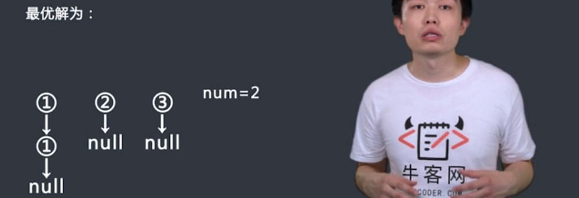
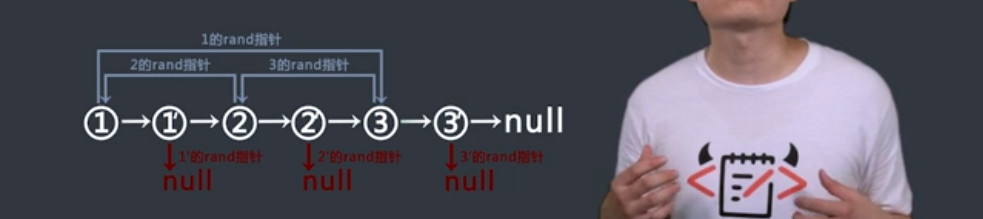

# 链表（一）基础操作

## 环形链表插值
`题目`
有一个整数val，如何在节点值有序的环形链表中插入一个节点值为val的节点，并且保证这个环形单链表依然有序。
给定链表的信息，及元素的值A及对应的nxt指向的元素编号同时给定val，请构造出这个环形链表，并插入该值。

<!--more-->

>输入：[1,3,4,5,7],[1,2,3,4,0],2
>返回：{1,2,3,4,5,7}

`代码`
```c++
#include <iostream>
#include <vector>

using namespace std;

struct ListNode {
    int val;
    struct ListNode *next;

    ListNode(int x) : val(x), next(NULL) {}
};

class InsertValue {
public:
    ListNode *insert(vector<int> A, vector<int> nxt, int val) {
        // write code here
        ListNode *phead = createList(A, nxt);
        if (!phead) {
            phead = new ListNode(val);
            phead->next = phead;
            return phead;
        }
        ListNode *pnode = phead;
        while (val > pnode->val) {
            pnode = pnode->next;
            if (pnode == phead)break;
        }
        ListNode *ptep = new ListNode(pnode->val);
        ptep->next = pnode->next;
        pnode->next = ptep;
        pnode->val = val;
        if (phead == pnode) return (pnode->val > ptep->val ? ptep : phead);
        else return phead;

    }

    ListNode *createList(const vector<int> &val, const vector<int> &nxt) {
        if (val.empty() || nxt.empty() || val.size() != nxt.size())
            return nullptr;
        ListNode *head = new ListNode(val[0]);
        ListNode *node = head;
        vector<int>::size_type index = 0;
        for (index = 0; index < nxt.size(); index++) {
            node->next = new ListNode(val[nxt[index]]);
            node = node->next;
        }
        node->next = head->next;
        ListNode *p = head;
        head = node;
        delete p;
        return head;
    }

    void printList(const ListNode *head) {
        ListNode *p;
        if (head) {
            cout << head->val << endl;
            for (p = head->next; p != head; p = p->next) {
                cout << p->val << endl;
            }
        }
    }

};

int main() {
    vector<int> A = {1, 3, 4, 5, 7};
    vector<int> nxt = {1, 2, 3, 4, 0};
    ListNode *p = nullptr;
    InsertValue ins;
    p = ins.insert(A, nxt, 0);
    ins.printList(p);
    return 0;
}
```
`注意`
如何在当前节点之后插入一个值：
- 分配一个节点，将插入值存入该节点
- 插入节点的next指向当前节点的next；当前节点的next指向插入节点。

如何在当前节点之前插入一个值：
- 分配一个节点，值为当前节点的复制
- 新增节点的next指向当前节点的next；
- 当前节点的next指向新增节点，当前节点的值赋值为插入值。

循环有序链表插入问题：
- 如果插入值为定位在头节点之前，该值要么值最小值，要么是最大值；
- 如果是最大值，不需要改变头节点，如果是最小值，将头节点指针指向最小值；


## 删除单链表中的一个值
`题目`
给定单链表和给定值，删除单链表中的这个值

`代码`
```c++
#include <iostream>
#include <vector>

using namespace std;

struct ListNode {
    int val;
    struct ListNode *next;

    ListNode(int x) : val(x), next(NULL) {}
};

class Remove {
public:
    ListNode *removeNode(ListNode *pHead, int delVal) {
        // write code here
        if (!pHead)return pHead;
        if (pHead->val == delVal) {
            ListNode *p = pHead->next;
            pHead->next=NULL;
            delete pHead;
            return p;
        }
        ListNode *cur = pHead->next;
        ListNode *pre = pHead;
        while (cur != NULL) {
            if (cur->val == delVal) {
                pre->next = cur->next;
                cur->next = NULL;
                delete cur;
                break;
            }
            cur = cur->next;
            pre = pre->next;
        }
        return pHead;
    }

    ListNode *createList(const vector<int> &A) {
        if (A.empty())return nullptr;
        ListNode *phead = new ListNode(A[0]);
        ListNode *pnode = phead;
        for (vector<int>::size_type index = 1; index < A.size(); index++) {
            ListNode *ptmp = new ListNode(A[index]);
            pnode->next = ptmp;
            pnode = ptmp;
        }
        return phead;
    }

    void printList(ListNode *phead) {
        ListNode *p = phead;
        if (p) {
            cout << p->val << endl;
            p = p->next;
            while (p) {
                cout << p->val << endl;
                p = p->next;
            }
        }
        cout << endl;
    }
};

int main() {
    vector<int> A{0, 1, 2, 3, 4};
    Remove R;
    ListNode *p = NULL;
    p = R.createList(A);
    R.printList(p);
    p = R.removeNode(p, 0);
    R.printList(p);

    return 0;
}
```

`注意`
假定只能访问删除节点，不能访问删除节点的前一个节点，如何删除
- 如果删除节点的后一个节点不为空，则可以将后一个节点的值复制到待删除节点的值，然后将待删除节点指向后一个节点的后一个节点，删除后一个节点即可
- 如果删除节点为最后一个节点，则不能删除，会引起系统错误；

# 链表（二）习题

## 链表的分化练习题
`题目`
对于一个链表，我们需要用一个特定阈值完成对它的分化，使得小于等于这个值的结点移到前面，大于该值的结点在后面，同时保证两类结点内部的位置关系不变。
给定一个链表的头结点head，同时给定阈值val，请返回一个链表，使小于等于它的结点在前，大于等于它的在后，保证结点值不重复。

>{1,4,2,5},3
>{1,2,4,5}

`过程`



`代码`
```c++
class Divide {
public:
    ListNode *listDivide(ListNode *head, int val) {
        // write code here
        ListNode *maxhead = NULL;
        ListNode *maxtail = NULL;
        ListNode *minhead = NULL;
        ListNode *mintail = NULL;
        ListNode *pnext = NULL;
        while (head) {
            pnext = head->next;
            head->next = NULL;
            if (head->val <= val) {
                if (minhead == NULL) {
                    minhead = head;
                    mintail = head;
                } else {
                    mintail->next = head;
                    mintail = head;
                }
            } else {
                if(maxhead == NULL){
                    maxhead = head;
                    maxtail = head;
                }else{
                    maxtail->next = head;
                    maxtail = head;
                }
            }
            head = pnext;
        }
        if(mintail !=NULL)
            mintail->next = maxhead;
        return minhead!=NULL? minhead: maxhead;
    }
};
```

## 打印两个链表的公共值
`题目`
现有两个升序链表，且链表中均无重复元素。请设计一个高效的算法，打印两个链表的公共值部分。
给定两个链表的头指针headA和headB，请返回一个vector，元素为两个链表的公共部分。请保证返回数组的升序。两个链表的元素个数均小于等于500。保证一定有公共值

>{1,2,3,4,5,6,7},{2,4,6,8,10}
>返回：[2.4.6]

`过程`
- 如果两个链表其中有一个为空，则返回；
- 两个指针分别指向两个链表，如果链表1的值小于链表2的值，则链表1往后移动一个位置
- 如果链表2的值小于链表1的值，则链表2往后移动一个位置
- 如果值相等，把值存入vector，然后两个链表都往后移动一个位置。

`代码`
```c++
class Common {
public:
    vector<int> findCommonParts(ListNode* headA, ListNode* headB) {
        // write code here
        vector<int> ret;
        ListNode* pa=headA;
        ListNode* pb=headB;
        if(pa==NULL || pb==NULL)return;
        while(pa!=NULL&&pb!=NULL){
            if(pa->val<pb->val)pa=pa->next;
            else if(pa->val>pb->val)pb=pb->next;
            else{
                ret.push_back(pa->val);
                pa=pa->next;
                pb=pb->next;
            }
        }
        return ret;
    }
};
```
## 链表的K逆序练习
`题目`
有一个单链表，请设计一个算法，使得每K个节点之间逆序，如果最后不够K个节点一组，则不调整最后几个节点。例如链表1->2->3->4->5->6->7->8->null，K=3这个例子。调整后为，3->2->1->6->5->4->7->8->null。因为K==3，所以每三个节点之间逆序，但其中的7，8不调整，因为只有两个节点不够一组。
给定一个单链表的头指针head,同时给定K值，返回逆序后的链表的头指针。

`过程`
- 根据区间的程度K求出每一个区段的前一个值，后一个值，开始值，结束值
- 然后进行逆序

`代码`

```c++

class KInverse {
public:
    ListNode *inverse(ListNode *head, int k) {
        // write code here
        if (k < 2) return head;
        ListNode *cur = head;//当前值，循环为每一个区段的最后一个值
        ListNode *pre = NULL;//当前区间的前一个值
        ListNode *start = NULL;//当前区间的开始值
        ListNode *next = NULL;//当前值的下一个值，循环为每一个区段的后一个值
        int count = 1;
        while (cur != NULL) {
            next = cur->next;//记录当前值的下一个值，用于循环进行
            if (count == k) {
                start = pre == NULL ? head : pre->next;//如果pre为空，则start为head，否则为pre的next；
                head = pre == NULL ? cur : head;//如果pre为空，head为第一次逆序的头一个值，即为逆序前的最后一个值cur；否则保持head
                resign(pre, start, cur, next);//逆序
                pre = start;//下一个区段的pre为当前区段的start；
                count = 0;
            }
            count++;
            cur = next;
        }
        return head;
    }

    void resign(ListNode *left, ListNode *start, ListNode *end, ListNode *right) {
        ListNode * pre = start;//pre为开始值
        ListNode * cur = start->next;//cur为开始值的next；
        ListNode * next = NULL;
        while(cur != right){
            next = cur->next;//保存cur的next；用于循环
            cur ->next = pre;//当前值的下一个值为前驱节点pre
            pre = cur;//前驱节点调到cur
            cur = next;
        }
        if(left != NULL)//如果存在前段区间，则将前段区间的后一个值为end；
            left -> next = end;
        start->next = right;//start变为当前区段的最后一个值，next指向right；
    }
}
```
## 链表指定值清除
`题目`
现在有一个单链表。链表中每个节点保存一个整数，再给定一个值val，把所有等于val的节点删掉。
给定一个单链表的头结点head，同时给定一个值val，请返回清除后的链表的头结点，保证链表中有不等于该值的其它值。请保证其他元素的相对顺序。

`过程`
- 删除前几个为指定值的节点，将头节点移动到第一个不为删除值的节点；
- 用pre制定为不为val的节点，cur指向pre的后一个节点，如果cur为val，则pre的next指向cur的next；否则pre指向cur； 然后cur跳为下一个；

`代码`

```c++
class ClearValue {
public:
    ListNode *clear(ListNode *head, int val) {
        // write code here
        while (head != NULL) {
            if (head->val != val) {
                break;
            }
            head = head->next;
        }
        ListNode *cur = head->next;
        ListNode *pre = head;
        while (cur != NULL) {
            if (cur->val == val) {
                pre->next = cur->next;
                cur = cur->next;
            } else {
                pre = cur;
                cur = cur->next;
            }
        }
        return head;
    }
}
```

## 链表回文结构
`题目`
请编写一个函数，检查链表是否为回文。
给定一个链表ListNode* pHead，请返回一个bool，代表链表是否为回文。

`过程`
方法一
- 遍历链表，将链表的每一个元素压入到栈中；
- 第二次遍历链表，比较每一个值和栈中弹出值，如果遇到不相等的则不是回文

方法二
- 定义快慢指针， 快指针一次走两个，慢指针一次走一个，将慢指针的值压入到栈中
- 如果快指针的下一个值为空，则为奇数个，应该弹出一个栈顶元素
- 慢指针依次向后遍历，比较栈顶元素和链表值，如果遇到不相等的，则不是回文

方法三
- 定义快慢指针，定义快慢指针， 快指针一次走两个，慢指针一次走一个，找到中间值
- 将中间值往后的链表元素进行逆转
- 从两头往中间遍历链表，比较对应的元素，如果出现不相等的，则不是回文


`代码`

```c++
class Palindrome {
public:
    bool isPalindrome(ListNode *pHead) {
        // write code here
        //方法一：全部压入
//        stack<int> liststack;
//        ListNode *pnode = pHead;
//        while (pnode != NULL) {
//            liststack.push(pnode->val);
//            pnode = pnode->next;
//        }
//        pnode = pHead;
//        while (pnode != NULL) {
//            if (liststack.top() != pnode->val) {
//                return false;
//            };
//            liststack.pop();
//            pnode = pnode->next;
//        }
//        return true;

        //方法二：快慢指针
//        stack<int> liststack;
//        ListNode *pslownode = pHead;
//        ListNode *pfastnode = pHead;
//        int count = 1;
//        while (pfastnode != NULL) {
//            liststack.push(pslownode->val);
//            if (pfastnode->next == NULL)break;
//            if (pfastnode->next->next != NULL) {
//                pfastnode = pfastnode->next->next;
//                pslownode = pslownode->next;
//                count++;
//            } else
//                break;
//        }
//        if(pfastnode->next == NULL)
//            liststack.pop();
//        pslownode = pslownode->next;
//        while(pslownode !=NULL){
//            if(pslownode->val == liststack.top()){
//                pslownode = pslownode->next;
//                liststack.pop();
//            }else return false;
//        }
//        return true;
        //方法三：逆序指针
        ListNode *pslownode = pHead;
        ListNode *pfastnode = pHead;
        ListNode *pnode = pHead;
        while(pfastnode&&pfastnode->next){
            pfastnode = pfastnode->next->next;
            pslownode = pslownode->next;
        }
        ListNode *pre = NULL;
        while(pslownode){
            ListNode *temp = pslownode->next;
            pslownode->next = pre;
            pre = pslownode;
            pslownode = temp;
        }
        while(pre){
            if(pre->val == pnode ->val){
                pre= pre->next;
                pnode = pnode->next;
            }else
                return false;
        }
        return true;
    }
}
```

# 链表（三）习题

## 复杂链表的复制练习题
`题目`
输入一个复杂链表（每个节点中有节点值，以及两个指针，一个指向下一个节点，另一个特殊指针指向任意一个节点）。

`过程`
- 遍历链表，将链表复制一份

- 遍历节点，拿到一对拷贝，拷贝的链表的random为链表的random，找到random指向的链表，将拷贝链表的random指向链表的下一个
- 将两个链表分离


`代码`
```c++
/*
struct RandomListNode {
    int label;
    struct RandomListNode *next, *random;
    RandomListNode(int x) :
            label(x), next(NULL), random(NULL) {
    }
};
*/
class Solution {
public:
    RandomListNode* Clone(RandomListNode* pHead)
    {
        if(pHead == NULL)return NULL;
        RandomListNode* cur = pHead;
        RandomListNode* next = NULL;
        while(cur != NULL){
            next = cur->next;
            cur->next = new RandomListNode(cur->label);
            cur->next->next = next;
            cur = next;
        }
        
        cur = pHead;
        RandomListNode* curCopy = NULL;
        while(cur != NULL){
            next = cur->next->next;
            curCopy = cur->next;
            curCopy->random = cur->random != NULL ? cur->random->next : NULL;
            cur = next;
        }
        
        cur = pHead;
        RandomListNode* res = pHead->next;
        while(cur != NULL){
            next = cur->next->next;
            curCopy = cur->next;
            cur->next = next;
            curCopy->next = next != NULL ? next->next : NULL;
            cur = next;
        }
        return res;
    }
};
```
## 链表判断环
`题目`
如何判断一个单链表是否有环？有环的话返回进入环的第一个节点的值，无环的话返回-1。如果链表的长度为N，请做到时间复杂度O(N)，额外空间复杂度O(1)。
给定一个单链表的头结点head（注意另一个参数adjust为加密后的数据调整参数，方便数据设置，与本题求解无关)，请返回所求值。

`过程`
- 定义快慢指针，依次遍历，当快慢指针相等时候，则认定链表又环，如果没有相等，则没有环
- 如果链表有环，则将快指针指向头，慢指针从原来位置继续遍历，每一次遍历一个，知道两个指针相等，返回指针的值即可

`代码`
```c++
/*
struct ListNode {
    int val;
    struct ListNode *next;
    ListNode(int x) : val(x), next(NULL) {}
};*/
class ChkLoop {
public:
    int chkLoop(ListNode* head, int adjust) {
        // write code here
        if(head == NULL || head->next == NULL)return -1;
        ListNode* pfastnode = head;
        ListNode* pslownode = head;
        while(pfastnode != NULL && pfastnode->next !=NULL){
            pslownode = pslownode->next;
            pfastnode = pfastnode->next->next;
            if(pslownode == pfastnode)break;
        }
        if(pslownode == pfastnode){
            pfastnode = head;
            while(pfastnode != pslownode){
                pfastnode = pfastnode->next;
                pslownode = pslownode->next;
            }
            return pfastnode->val;
        }else{
            return -1;
        }
    }
};
```

## 无环单链表相交
`题目`
现在有两个无环单链表，若两个链表的长度分别为m和n，请设计一个时间复杂度为O(n + m)，额外空间复杂度为O(1)的算法，判断这两个链表是否相交。
给定两个链表的头结点headA和headB，请返回一个bool值，代表这两个链表是否相交。保证两个链表长度小于等于500。

`过程`
方法一
- 将链表A节点存入hash表中，遍历链表B，看是否存在对应B元素在hash表中存在

方法二
- 先遍历两个链表，求出两个链表的长度
- 将较长的链表先遍历长度差值，剩下两个长度相同的链表
- 同时遍历，如果相交，则在同一节点相遇，两节点指针相同


`代码`
```c++
/*
struct ListNode {
    int val;
    struct ListNode *next;
    ListNode(int x) : val(x), next(NULL) {}
};*/
class CheckIntersect {
public:
    bool chkIntersect(ListNode* headA, ListNode* headB) {
        // write code here
        ListNode* pa = headA;
        ListNode* pb = headB;
        if(pa==NULL || pb == NULL)return false;
        int countA=0, countB=0;
        while(pa != NULL){
            pa = pa->next;
            countA++;
        }
        while(pb != NULL){
            pb = pb->next;
            countB++;
        }
        int countC = countA>countB?countA-countB:countB-countA;
        pa=headA;pb=headB;
        while(countC){
            if(countA>countB){
                pa=pa->next;
                countC--;
            }else{
                pb=pb->next;
                countC--;
            }
        }
        while(pa!=NULL&&pb!=NULL){
            if(pa == pb)return true;
            pa=pa->next;
            pb=pb->next;
        }
        return false;
    }
};
```

## 有环单链表相交
`题目`
如何判断两个有环单链表是否相交？相交的话返回第一个相交的节点，不想交的话返回空。如果两个链表长度分别为N和M，请做到时间复杂度O(N+M)，额外空间复杂度O(1)。
给定两个链表的头结点head1和head2(注意，另外两个参数adjust0和adjust1用于调整数据,与本题求解无关)。请返回一个bool值代表它们是否相交。
`过程`
- 先利用快慢指针分别求出两个有环链表的入环节点，如果两个入环节点相等，则返回true
- 从链表1的入环节点开始往下遍历，如果遇到为start1，则无相交，如果遇到start2，则相交


`代码`
```c++
/*
struct ListNode {
    int val;
    struct ListNode *next;
    ListNode(int x) : val(x), next(NULL) {}
};*/
class ChkIntersection {
public:
    bool chkInter(ListNode* head1, ListNode* head2, int adjust0, int adjust1) {
        // write code here
        ListNode* start1 = enterHuan(head1);
        ListNode* start2 = enterHuan(head2);
        if(start1 == start2)return true;
        ListNode* p=start1->next;
        while(p!=start1&&p!=start2)
            p = p->next;
        if(p == start2)
            return true;
        return false;
    }
    ListNode* enterHuan(ListNode* head){
        ListNode* pfastnode=head;
        ListNode* pslownode=head;
        while(pfastnode&&pfastnode->next){
            pfastnode = pfastnode->next->next;
            pslownode = pslownode->next;
            if(pfastnode == pslownode)break;
        }
        if(pfastnode == pslownode){
            pfastnode = head;
            while(pfastnode != pslownode){
                pfastnode = pfastnode->next;
                pslownode = pslownode->next;
            }
            return pslownode;
        }else{
            return NULL;
        }
    }
};
```

## 单链表相交
`题目`
给定两个单链表的头节点head1和head2，如何判断两个链表是否相交？相交的话返回true，不想交的话返回false。
给定两个链表的头结点head1和head2(注意，另外两个参数adjust0和adjust1用于调整数据,与本题求解无关)。请返回一个bool值代表它们是否相交。

`过程`
- 判断链表是否有环，有环返回入环，无环则返回空
- 如果一个有环，一个无环，则不可能相交
- 如果两个都无环，则按照无环链表相交判断
- 如果两个都有环，则按照有环链表相交判断

`代码`
```c++
/*
struct ListNode {
    int val;
    struct ListNode *next;
    ListNode(int x) : val(x), next(NULL) {}
};*/
class ChkIntersection {
public:
    bool chkInter(ListNode* head1, ListNode* head2, int adjust0, int adjust1) {
        // write code here
        ListNode* p1 = chkLoop(head1);
        ListNode* p2 = chkLoop(head2);
        if((p1==NULL&&p2!=NULL) ||(p1!=NULL&&p2==NULL))return false;
        if(p1 == NULL && p2 == NULL)return chkIntersect(head1, head2);
        else return chkInter(head1, head2);
    }
    //判断是否有环
    ListNode* chkLoop(ListNode* head) {
        // write code here
        if(head == NULL || head->next == NULL)return NULL;
        ListNode* pfastnode = head;
        ListNode* pslownode = head;
        while(pfastnode != NULL && pfastnode->next !=NULL){
            pslownode = pslownode->next;
            pfastnode = pfastnode->next->next;
            if(pslownode == pfastnode)break;
        }
        if(pslownode == pfastnode){
            pfastnode = head;
            while(pfastnode != pslownode){
                pfastnode = pfastnode->next;
                pslownode = pslownode->next;
            }
            return pfastnode;
        }else{
            return NULL;
        }
    }
    //无环链表相交
    bool chkIntersect(ListNode* headA, ListNode* headB) {
        // write code here
        ListNode* pa = headA;
        ListNode* pb = headB;
        if(pa==NULL || pb == NULL)return false;
        int countA=0, countB=0;
        while(pa != NULL){
            pa = pa->next;
            countA++;
        }
        while(pb != NULL){
            pb = pb->next;
            countB++;
        }
        int countC = countA>countB?countA-countB:countB-countA;
        pa=headA;pb=headB;
        while(countC){
            if(countA>countB){
                pa=pa->next;
                countC--;
            }else{
                pb=pb->next;
                countC--;
            }
        }
        while(pa!=NULL&&pb!=NULL){
            if(pa == pb)return true;
            pa=pa->next;
            pb=pb->next;
        }
        return false;
    }
    //有环链表是否相交
    bool chkInter(ListNode* head1, ListNode* head2) {
        // write code here
        ListNode* start1 = enterHuan(head1);
        ListNode* start2 = enterHuan(head2);
        if(start1 == start2)return true;
        ListNode* p=start1->next;
        while(p!=start1&&p!=start2)
            p = p->next;
        if(p == start2)
            return true;
        return false;
    }
    ListNode* enterHuan(ListNode* head){
        ListNode* pfastnode=head;
        ListNode* pslownode=head;
        while(pfastnode&&pfastnode->next){
            pfastnode = pfastnode->next->next;
            pslownode = pslownode->next;
            if(pfastnode == pslownode)break;
        }
        if(pfastnode == pslownode){
            pfastnode = head;
            while(pfastnode != pslownode){
                pfastnode = pfastnode->next;
                pslownode = pslownode->next;
            }
            return pslownode;
        }else{
            return NULL;
        }
    }
};
```