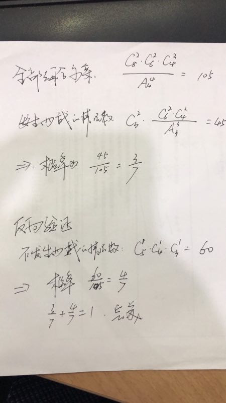
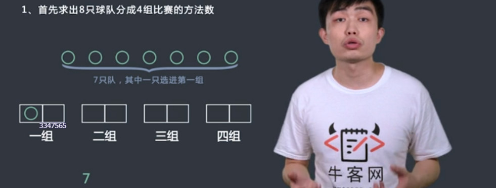
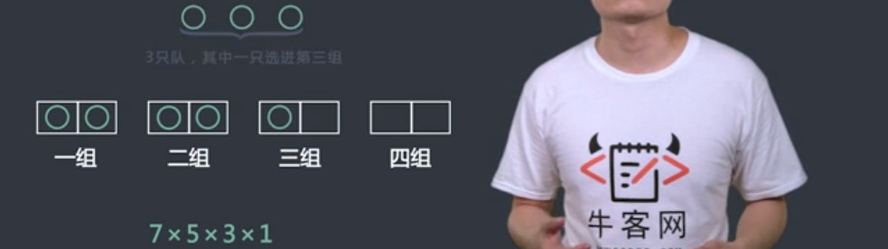
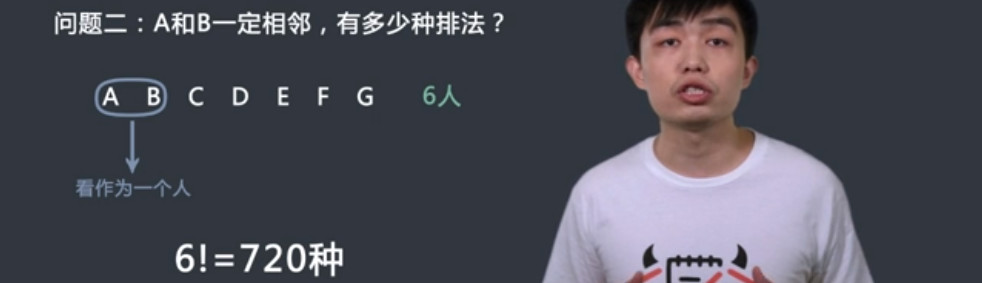
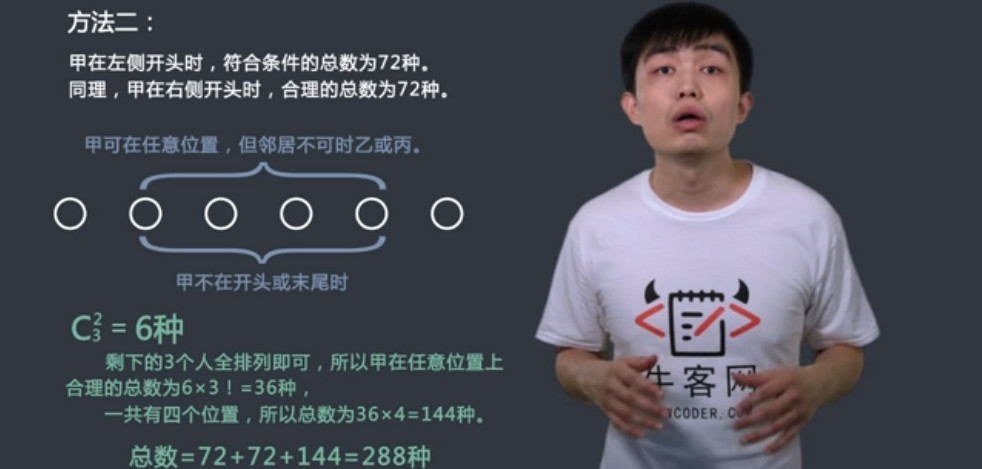
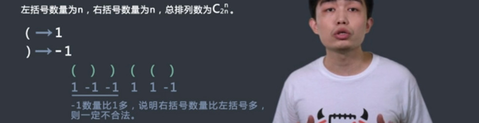
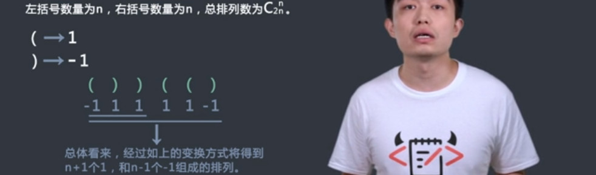

# 概率（一）习题

`题目`
有2k只球队，有k-1个强队，其余都是弱队，随机把它们分成k组比赛，每组两个队，问两强相遇的概率是多大？

给定一个数k，请返回一个数组，其中有两个元素，分别为最终结果的分子和分母，请化成最简分数

<!--more-->

>4
>返回：[3,7]

`过程`





`代码`
```c++
省略
```

# 排列组合（一）习题

## 方格移动
`题目`
在XxY的方格中，以左上角格子为起点，右下角格子为终点，每次只能向下走或者向右走，请问一共有多少种不同的走法
给定两个正整数int x,int y，请返回走法数目。保证x＋y小于等于12。
>2,2
>返回：2

`过程`


`代码`
```c++
class Robot {
public:
    int countWays(int x, int y) {
        // write code here
        --x;--y;
        int n = x+y;
        int m = x;
        int A = 1;
        for(int i = n; i >= n-m+1;i--){
            A = A*i;
        }
        for(int i = m; i>=2; i--){
            A = A/i;
        }
        return A;
    }
};
```

## 站队问题练习题
`题目`
n个人站队，他们的编号依次从1到n，要求编号为a的人必须在编号为b的人的左边，但不要求一定相邻，请问共有多少种排法？第二问如果要求a必须在b的左边，并且一定要相邻，请问一共有多少种排法？
给定人数n及两个人的编号a和b，请返回一个两个元素的数组，其中两个元素依次为两个问题的答案。保证人数小于等于10。
>7,1,2
>返回：[2520,720]

`过程`



`代码`
```c++
class StandInLine {
public:
    vector<int> getWays(int n, int a, int b) {
        // write code here
        int temp=1;
        vector<int> ret;
        for(int i = n; i >= 1; i--){
            temp = temp*i;
        }
        ret.push_back(temp/2);
        ret.push_back(temp/n);
        return ret;
    }
};
```
## 孤傲的A练习题
`题目`
A(A也是他的编号)是一个孤傲的人，在一个n个人(其中编号依次为1到n)的队列中，他于其中的标号为b和标号c的人都有矛盾，所以他不会和他们站在相邻的位置。现在问你满足A的要求的对列有多少种？
给定人数n和三个人的标号A,b和c，请返回所求答案，保证人数小于等于11且大于等于3。
>6,1,2,3
>288

`过程`





`代码`
```c++
class LonelyA {
public:
    int getWays(int n, int A, int b, int c) {
        // write code here
        int all = 1;
        int ab = 1;
        int ac = 1;
        int abc = 1;
        for(int i = n; i >= 1; i--){
             all = all * i;
        }
        for(int i = n-1; i >= 1; i--){
            ab = ab * i;
            ac = ac * i;
        }
        ab = ab * 2;
        ac = ac * 2;
        for(int i = n-2; i >= 1; i--){
            abc = abc * i;
        }
        abc = abc * 2;
        return all-ab-ac+abc;
    }
};
```
## 分糖果练习题
`题目`
n颗相同的糖果，分给m个人，每人至少一颗，问有多少种分法。
给定n和m，请返回方案数，保证n小于等于12，且m小于等于n。

>10,3
>返回：36

`过程`


`代码`
```c++
class Distribution {
public:
    int getWays(int n, int m) {
        // write code here
        int cn = n-1;
        int cm = m-1;
        int A = 1;
        for(int i = cn; i >= cn-cm+1;i--){
            A = A*i;
        }
        for(int i = cm; i>=2; i--){
            A = A/i;
        }
        return A;
    }
};
```
## 卡特兰数练习题
`题目`
1、假设有n对左右括号，请求出合法的排列有多少个？合法是指每一个括号都可以找到与之配对的括号，比如n=1时，()是合法的，但是)(为不合法。
给定一个整数n，请返回所求的合法排列数。保证结果在int范围内。

2、n个数进出栈的顺序有多少种？假设栈的容量无限大。
给定一个整数n，请返回所求的进出栈顺序个数。保证结果在int范围内。

3、2n个人排队买票，n个人拿5块钱，n个人拿10块钱，票价是5块钱1张，每个人买一张票，售票员手里没有零钱，问有多少种排队方法让售票员可以顺利卖票。
给定一个整数n，请返回所求的排队方案个数。保证结果在int范围内。

>1
>返回：1

`过程`





`代码`
```c++
class Parenthesis {
public:
    int countLegalWays(int n) {
		int A = 1;
		for(int i = n + 1;i <= n + n;++ i) A *= i;
		for(int i = 2;i <= n + 1;++ i) A /= i;
		return A;	
    }
};
```

## 二叉树统计练习题
`题目`
求n个无差别的节点构成的二叉树有多少种不同的结构？
给定一个整数n，请返回不同结构的二叉树的个数。保证结果在int范围内。

>1
>返回：1

`过程`


`代码`
```c++
class Parenthesis {
public:
    int countLegalWays(int n) {
		int A = 1;
		for(int i = n + 1;i <= n + n;++ i) A *= i;
		for(int i = 2;i <= n + 1;++ i) A /= i;
		return A;	
    }
};
```

## 高矮排序练习题
`题目`
12个高矮不同的人，排成两排，每排必须是从矮到高排列，而且第二排比对应的第一排的人高，问排列方式有多少种？
给定一个偶数n，请返回所求的排列方式个数。保证结果在int范围内。
>1
>返回：1

`过程`


`代码`
```c++
class Parenthesis {
public:
    int countLegalWays(int n) {
		int A = 1;
		n = n / 2;
		for(int i = n + 1;i <= n + n;++ i) A *= i;
		for(int i = 2;i <= n + 1;++ i) A /= i;
		return A;	
    }
};
```