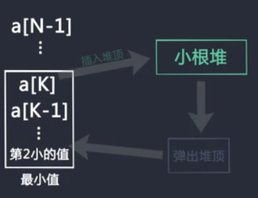
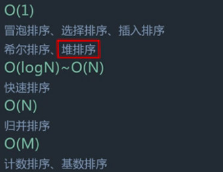

# 排序（一）基础排序算法

## 冒泡排序
时间复杂度为O(N2)

过程:
- 循环空间为0到N-1，第一个数和第二个数比较，较大的放在后面，第二个和第三个数比较，较大的放在后面，一直循环到最后，最大的数放在最后面N-1位置。
- 循环空间为0到N-2，依次比较相邻的数，最大的数放在N-2位置。
- 循环空间为0到1，最大的数放在1位置。

<!--more-->

```c++
class BubbleSort {
public:
    int* bubbleSort(int* A, int n) {
        // write code here
        for(int i=n-1;i>=1;i--){
            for(int j=0;j<i;j++){
                if(A[j]>A[j+1]){
                    int t = A[j];
                    A[j]=A[j+1];
                    A[j+1]=t;
                }
            }
        }
        return A;
    }
};
```
## 选择排序
时间复杂度为O(N2)

过程：
- 循环空间为0到N-1，选择最小的和0位置交换
- 循环空间为1到N-1, 选择最小的和1位置交换
- 循环空间为N-2到N-1，选择最小的和N-2交换
```c++
class SelectionSort {
public:
    int* selectionSort(int* A, int n) {
        // write code here
        for(int i=0;i<n-1;i++){
            int min = i;
            for(int j=i+1;j<n;j++){
                if(A[j]<=A[min])min=j;
            }
            int t = A[i];
            A[i]=A[min];
            A[min]=t;
        }
        return A;
    }
};
```
## 插入排序
时间复杂度为O(N2)

过程：
- 循环空间为0-1，如果位置1上的数小于位置0上的数，交换
- 循环空间为0-2，如果位置2上的数小于前面位置的数，前面位置的数往后移动
- 循环空间为0-N-1，如果位置N上的数小于前面的数，前面位置的数往后移动
- 直到前面的数小于等于当前比较的数，这个数就插入该位置，后面的数往后移
```c++
class InsertionSort {
public:
    int* insertionSort(int* A, int n) {
        // write code here
        for(int i=1;i<=n-1;i++){
            int k = A[i];
            int j;
            for(j=i-1;j>=0;j--){
                if(A[j]>=k)A[j+1]=A[j];
                else break;
            }
            A[j+1]=k;
        }
        return A;
    }
};
```
## 归并排序
时间复杂度为O(N*logN)

过程：
- 数组的每一个数变成长度为1的有序空间，把相邻的组进行合并，得到最大长度为2的有序区间
- 将长度为2的有序区间进行合并，得到最大长度为4的有序区间
- 一直进行下去，直到得到只有一个有序区间停止
```c++
class MergeSort {
public:
    int *mergeSort(int *A, int n) {
        // write code here
        mergeSort1(A,0,n-1);
        return A;
    }

    void Merge(int *A, int low, int mid, int high) {
        int i = low;
        int j = mid + 1;
        int k = 0;
        int *B = new int[high - low + 1];

        while (i <= mid && j <= high) {
            if (A[i] <= A[j]) {
                B[k++] = A[i++];
            } else {
                B[k++] = A[j++];
            }
        }
        while (i <= mid) {
            B[k++] = A[i++];
        }
        while (j <= high) {
            B[k++] = A[j++];
        }
        for (k = 0, i = low; i <= high; i++, k++) {
            A[i] = B[k];
        }
    }

    void mergeSort1(int *A, int low, int high) {
        if (low >= high)return;
        int mid = (low + high) / 2;
        mergeSort1(A, low, mid);
        mergeSort1(A, mid + 1, high);
        Merge(A, low, mid, high);
    }
};
```
## 快速排序
时间复杂度为O(N*logN)

过程：
- 随机的在数组中选择一个数，将小于等于该数的放在这个数的前面，大于该数的放在该数的后面
- 左边选出的数和右边选出的数又随机选择一个数，依次递归调用上述过程

完整划分过程（时间复杂度为O(N)）：
- 将划分值和最后一个元素交换，设定划分区间为-1
- 依次遍历，如果当前元素大于划分值，比较下一个元素
- 如果当前元素小于划分值，将该元素和划分区间+1的位置元素交换，然后将划分区间值加1
- 直到便利完一遍后，没有发现比划分值小的，将划分值和划分区间值的后一个位置值交换
```c++
class QuickSort {
public:
    int *quickSort(int *A, int n) {
        // write code here
        qSort(A,0,n-1);
        return A;
    }

    int partion(int *A, int low, int high) {
        int div = low - 1;
        int t;
        for (int i = low; i < high; i++) {
            if (A[i] <= A[high]) {
                t = A[div + 1];
                A[div + 1] = A[i];
                A[i] = t;
                div++;
            }
        }
        t = A[div + 1];
        A[div + 1] = A[high];
        A[high] = t;
        return div+1;
    }

    void qSort(int *A, int low, int high){
        if(low>=high)return;
        int p=partion(A,low,high);
        qSort(A,low,p-1);
        qSort(A,p+1,high);
    }
};
```

## 堆排序
时间复杂度为O(N*logN)

过程：
- 将数组中的N个数建立成为大小为N的大根堆
- 将堆顶的值和堆最后一个值交换，选出最大值，将此值剔除该堆，放在数组位置N
- 将大小为N-1的堆进行大根堆的调整，将N-1数中的最大值放在堆顶的位置，将堆顶的位置和堆最后一个元素交换，将此值剔除该堆，放在数组位置N-1
- 循环直到剩下最后一个元素

## 希尔排序
时间复杂度为O(N*logN)

过程：
- 设定步长为3
- 比较位置3的数和位置3-3的数，如果小，则交换，再比较0-3<0，下一步
- 比较位置4的数和位置4-3的数，如果小，则交换，再比较1-3<0，下一步
- 比较位置5的数和位置5-3的数，如果小，则交换，再比较2-3<0，下一步
- 比较位置5的数和位置6-3的数，如果小，则交换，再比较3-3=0，比较6-3和位置6-3-3的值，如果小，则交换，依次进行上述比较
- 设定步长为2，过程类似
- 设定步长为1，过程类似，结束排序
```c++
class ShellSort {
public:
    int *shellSort(int *A, int n) {
        // write code here
        int gap = n / 2;
        while (gap > 0) {
            for (int i = gap; i < n; i++) {
                for (int j = i - gap; j >= 0; j -= gap) {
                    if (A[j] > A[j + gap]) {
                        int t = A[j];
                        A[j] = A[j + gap];
                        A[j + gap] = t;
                    }
                }
            }
            gap = gap / 2;
        }
        return A;
    }
};

```

# 排序（二）计数排序算法

## 计数排序和基数排序
不是基于比较的排序，思想来源于桶排序，有计数排序和基数排序。
### 计数排序
`原理`：
计数排序非常基础，他的主要目的是对整数排序并且会比普通的排序算法性能更好。例如，输入{1, 3, 5, 2, 1, 4}给计数排序，会输出{1, 1, 2, 3, 4, 5}。这个算法由以下步骤组成：
- 初始化一个计数数组，大小是输入数组中的最大的数。
- 遍历输入数组，遇到一个数就在计数数组对应的位置上加一。例如：遇到5，就将计数数组第五个位置的数加一。
- 把计数数组直接覆盖到输出数组（节约空间）。

`例子`:
输入{3, 4, 3, 2, 1}，最大是4，数组长度是5。
建立计数数组{0, 0, 0, 0}。
遍历输入数组：  
{**3**, 4, 3, 2, 1} -> {0, 0, 1, 0}  
{3, **4**, 3, 2, 1} -> {0, 0, 1, 1}  
{3, 4, **3**, 2, 1} -> {0, 0, 2, 1}  
{3, 4, 3, **2**, 1} -> {0, 1, 2, 1}  
{3, 4, 3, 2, **1**} -> {1, 1, 2, 1}  

计数数组现在是{1, 1, 2, 1}，我们现在把它写回到输入数组里：  
{0, 1, 2, 1} -> {1, 4, 3, 2, 1}  
{0, 0, 2, 1} -> {1, 2, 3, 2, 1}  
{0, 0, 1, 1} -> {1, 2, 3, 2, 1}  
{0, 0, 0, 1} -> {1, 2, 3, 3, 1}  
{0, 0, 0, 0} -> {1, 2, 3, 3, 4}

这样就排好序了。
- 时间：O(n + k)，n是输入数组长度，k是最大的数的大小。
- 空间：O(n + k)，n是输入数组长度，k是最大的数的大小。

`代码`:
```c++
class CountingSort {
public:
    int *countingSort(int *A, int n) {
        // write code here
        int i, j, num = 0;
        int max = 0, min = 0;
        for (int i = 1; i < n; i++) {
            if (A[i] > A[max])max = i;
            if (A[i] < A[min])min = i;
        }
        int countmax = A[max];
        int countmin = A[min];
        int countarray[countmax - countmin + 1];
        for (i = 0; i < countmax - countmin + 1; i++) {
            countarray[i]=0;

        }
        for (i = 0; i < n; i++) {
            countarray[A[i]  - countmin]++;
        }
        for (i = 0; i < countmax - countmin + 1; i++) {
            if (countarray[i] > 0) {
                for (j = 0; j < countarray[i]; j++) {
                    A[num++] = i  + countmin;
                }
            }
        }
        return A;
    }
};
```

# 排序（三）习题

## 小范围排序
`题目`
已知一个几乎有序的数组，几乎有序是指，如果把数组排好序，每个元素的移动距离不超过k，并且k相对于数组长度来说很小，用什么排序发比较好？
- 时间复杂度为o(n)的排序算法基数排序和基数排序，不知道数组的范围，因此不做考虑。
- 时间复杂度为o(n2)的排序算法冒泡排序和选择排序，与原始数组无关；插入排序与原始数据有关，对于本题，插入排序的时间复杂度为o(n*k)；
- 时间复杂度为o(n*logn)的排序算法，快速排序，归并排序与原始无关。
- 解决方法为改进后的堆排序。

`过程`



数组排序完毕，每得到一个数，代价为o(logk)，总共有n个数，时间复杂度为o(n*logk)。

## 重复值判断
`题目`
判断数组中是否有重复值，必须保证额外空间复杂度为o(1)。
- 如果没有空间限制，可以使用哈希表来做，统计是否有重复值。
- 先排序，然后遍历一遍之后看是否有相同的值

考虑经典排序算法，空间复杂度限制。



`代码`
### 使用hash表方法代码如下
```c++
class Checker {
public:
    bool checkDuplicate(vector<int> a, int n) {
        // write code here
        if(n<2) return false;
        auto ret = std::minmax_element(a.begin(),a.end());
        int min = *ret.first;
        int max = *ret.second;
        vector<size_t> map(max-min+1,0);
        for(auto x:a){
            if(++map[x-min]>1)return true;
        }
        return false;
    }
};
```
### 使用堆排序方法代码如下
堆排序为大部分为递归实现，因此需要改为非递归版本的堆排序。
## 有序数组合并
`题目`
把两个有序数组合并为一个数组，第一个数组的空间正好可以容纳两个数组的元素。
数组A:2 4 6_ _ _  
数组B:1 3 5
`过程`
- 从后向前覆盖，比较6和5，将6放入最后一个位置。
- 再比较4和5，将5放入6之前。
- 依次比较，直到数组B全部复制到数组A中。

`代码`
```c++
class Merge {
public:
    int* mergeAB(int* A, int* B, int n, int m) {
        // write code here
        int k = m + n-1;
        int i = n-1;
        int j = m-1;
        while(i>=0&&j>=0){
            if(A[i]>=B[j]){
                A[k--]=A[i--];
            }
            else{
                A[k--]=B[j--];
            }
            
        }
        while(j>=0){
            A[k--]=B[j--];
        }
        return A;
    }
};
```

## 三色排序/荷兰国旗
`题目`
题目有一个只由0，1，2三种元素构成的整数数组，请使用交换、原地排序而不是使用计数进行排序。
给定一个只含0，1，2的整数数组A及它的大小，请返回排序后的数组。保证数组大小小于等于500。
>输入：[0,1,1,0,2,2],6
>返回：[0,0,1,1,2,2]

`过程`
- 设置一个0区间，指向位置-1；设置一个2区间指向位置n；
- 从0位置开始遍历，如果遇到1，则跳到下一位置
- 如果遇到0，则将0和0区间的下一位置的数交换，跳到下一位置；
- 如果遇到2，则将2和2区间的前一位置的数交换，因为交换的数没有被遍历过，所以从当前位置开始判断；
- 直到遍历位置和2区间位置相等，结束遍历。

`代码`
```c++
class ThreeColor {
public:
    vector<int> sortThreeColor(vector<int> A, int n) {
        // write code here
        int begin = -1;
        int end = n;
        int t;
        for(int i=0;i<end;i++){
            if(A[i]==0){
                begin++;
                t = A[begin];
                A[begin] = A[i];
                A[i] = t;
                
            }
            if(A[i]==2){
                end--;
                t = A[end];
                A[end] = A[i];
                A[i] = t;
                i--;
            }
        }
        return A;
    }
};
```

## 有序矩阵查找问题
`题目`
现在有一个行和列都排好序的矩阵，请设计一个高效算法，快速查找矩阵中是否含有值x。
给定一个int矩阵mat，同时给定矩阵大小nxm及待查找的数x，请返回一个bool值，代表矩阵中是否存在x。所有矩阵中数字及x均为int范围内整数。保证n和m均小于等于1000。
>输入：[[1,2,3],[4,5,6],[7,8,9]],3,3,10
>返回：false

`过程`
- 从矩阵的右上角开始查找，即位置[0][m-1]，col=0，row=m-1；
- 当遍历的数大于需要查找的数的时候，这个数列的下方所有的数都大于需要查找的数，此时应该row--；
- 当遍历的数小于需要查找的数的时候，这个数行的左边所有的数都小于需要查找的数，此时应该col++;
- 如果找到此数，则返回true；如果没有找到，则返回false；

`代码`
```c++
class Finder {
public:
    bool findX(vector<vector<int> > mat, int n, int m, int x) {
        // write code here
        if(m <= 0 || n <= 0){
            return false;
        }
        int col=0,row=m-1;
        while(col<n&&row>=0){
            if(mat[col][row]>x)row--;
            else if(mat[col][row]<x)col++;
            else return true;
        }
        return false;
    }
};
```
## 最短子数组
`题目`
对于一个数组，请设计一个高效算法计算需要排序的最短子数组的长度。
给定一个int数组A和数组的大小n，请返回一个二元组，代表所求序列的长度。(原序列位置从0开始标号,若原序列有序，返回0)。保证A中元素均为正整数。
>输入：[1,4,6,5,9,10],6
>返回：2

`过程`
- 从左向右遍历，选择当前遍历阶段的最大值，如果遇到比最大值小的，记录下来为maxindex；
- 从右向左遍历，选择当前遍历阶段的最小值，如果遇到比最小值大的，记录下来为minindex；
- 如果maxindex-minindex<0，返回0，否则返回maxindex-minindex；

`代码`
```c++
class Subsequence {
public:
    int shortestSubsequence(vector<int> A, int n) {
        // write code here
        int maxindex = 0;
        int minindex = n-1;
        int max=A[0];
        int min=A[n-1];
        for(int i =0;i<n;i++){
            if(max<=A[i]){
                max=A[i];
            }else maxindex = i;
        }
        for(int j = n-1;j>=0;j--){
            if(min>=A[j]){
                min = A[j];
            }else minindex = j;
        }
        return maxindex>minindex?maxindex-minindex+1:0;
    }
};
```

## 相邻两数最大差值
`题目`
有一个整形数组A，请设计一个复杂度为O(n)的算法，算出排序后相邻两数的最大差值。
给定一个int数组A和A的大小n，请返回最大的差值。保证数组元素多于1个。
>输入：[1,2,5,4,6],5
>返回：2

`过程`
- 求出数组的最大值valueMax，最小值valueMin；
- 初始化设定两个桶bocketMax，bocketMin；初始化为INT_MIN和INT_MAX；
- 确定桶的长度len=valueMax-valueMin；如果长度小于1，则返回0；
- 将数组中的每一个元素装到桶中，桶序号index=(A[i]-valueMin)/len*(n-1)；
- 将桶中的最大元素保存在bocketMax，最小元素保存在bocketMin；
- 遍历数组，如果桶为空，则跳过，如果桶不为空，则用当前桶的最小值减去前一个不为空的pre桶的最大值，得到最大区间，将pre桶移动到当前桶位置，继续遍历，区最大区间的最大值即为所求。

`其他方法`
先排序再依次求差值
- 把vector中的元素依次遍历，保存到set中，实现排序；
- 遍历set，比较相邻的两个元素，得到区间，求区间的最大值。

`代码`
```c++
class Gap {
public:
    int maxGap(vector<int> A, int n) {
        // write code here
        int valueMax = A[0], valueMin = A[0];
        for(int i=0; i<n; i++){
            if(A[i]>valueMax)valueMax = A[i];
            if(A[i]<valueMin)valueMin = A[i];
        }
        vector<int> bocketMax(n, INT_MIN);
        vector<int> bocketMin(n, INT_MAX);
        int len = valueMax - valueMin;
        if(len<1)return 0;
        for(int i=0;i<n;i++){
            int index = (double)(A[i]-valueMin)/len*(n-1);
            bocketMax[index] = max(A[i], bocketMax[index]);
            bocketMin[index] = min(A[i], bocketMin[index]);
        }
        int ret=0, pre = bocketMax[0];
        for(int i=1;i<n;i++){
            if(bocketMin[i]!=INT_MAX){
                ret = max(ret, bocketMin[i]-pre);
                pre = bocketMax[i];
            }
        }
        return ret;
    }
};
```