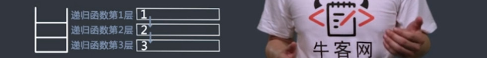
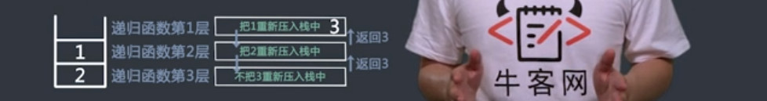

# 栈和队列（一）习题
## 可查询最值的栈的练习
`题目`
定义栈的数据结构，请在该类型中实现一个能够得到栈最小元素的min函数。

<!--more-->

`过程`


`代码`
```c++
class Solution {
public:
    stack<int> stackdata;
    stack<int> stackmin;
    void push(int value) {
        stackdata.push(value);
        if(stackmin.empty()){
            stackmin.push(value);
        }else{
            if(stackmin.top()>value)stackmin.push(value);
            else stackmin.push(stackmin.top());
        }
    }
    void pop() {
        stackdata.pop();
        stackmin.pop();
    }
    int top() {
        return stackdata.top();
    }
    int min() {
        return stackmin.top();
    }
};
```

## 双栈队列问题
`题目`
编写一个类,只能用两个栈结构实现队列,支持队列的基本操作(push，pop)。
给定一个操作序列ope及它的长度n，其中元素为正数代表push操作，为0代表pop操作，保证操作序列合法且一定含pop操作，请返回pop的结果序列。
>输入：[1,2,3,0,4,0],6
>返回：[1,2]

`过程`
- 两个栈，s1用来压入，s2用来弹出；
- 循环ope，如果ope[i]==0，则在s2中弹出元素；否则，将元素压入s1；
- 注意，必须要在s2全部弹出后，将s1中的元素全部压入到s2中；


`代码`
```c++
class TwoStack {
public:
    vector<int> twoStack(vector<int> ope, int n) {
        // write code here
        vector<int> ret;
        for(int i = 0;i<n;i++){
            if(ope[i]==0)ret.push_back(out());
            else enter(ope[i]);
        }
        return ret;
    }
    void enter(int value){
        s1.push(value);
    }
    int out(){
        int popvalue;
        if(s2.empty()){
            while(!s1.empty()){
                s2.push(s1.top());
                s1.pop();
           }
        }
        popvalue=s2.top();
        s2.pop();
        return popvalue;
    }
private:
    stack<int> s1,s2;
};
```
## 栈的反转
`题目`
实现一个栈的逆序，但是只能用递归函数和这个栈本身的pop操作来实现，而不能自己申请另外的数据结构。
给定一个整数数组A即为给定的栈，同时给定它的大小n，请返回逆序后的栈。
>输入：[4,3,2,1],4
>返回：[1,2,3,4]

`过程`
- get函数，移除栈底元素并返回，递归调用第一层，弹出栈顶元素1

- 递归调用第二，三层，依次弹出2，3

- 谈出3后，发现栈为空，返回3；

- 第二层中得到3，并把2压入栈中，返回3；

- 第一层中得到3，并把1压入栈中，返回3；

- 栈元素逆序的主方法reverse；

- 第一层，得到栈底3，并删除；

- 第二层，得到栈底2，并删除；

- 第三层，得到栈底1，并删除；

- 发现栈为空，返回，执行push操作，将1压入栈

- 执行push操作，将2，3压入栈


`代码`
```c++
class StackReverse {
public:
    vector<int> reverseStack(vector<int> A, int n) {
        // write code here
        reversed(A);
        return A;
    }
    void reversed(vector<int> &A){
        if(A.empty())return;
        int i = get(A);
        reversed(A);
        A.push_back(i);
    }
    int get(vector<int> &A){
        int result = A.back();
        A.pop_back();
        if(A.empty())return result;
        else{
            int last = get(A);
            A.push_back(result);
            return last;
        }
    }
    
};
```
## 双栈排序
`题目`
请编写一个程序，按升序对栈进行排序（即最大元素位于栈顶），要求最多只能使用一个额外的栈存放临时数据，但不得将元素复制到别的数据结构中。
给定一个int[] numbers(C++中为vector<int>)，其中第一个元素为栈顶，请返回排序后的栈。请注意这是一个栈，意味着排序过程中你只能访问到第一个元素。
>输入：[1,2,3,4,5]
>返回：[5,4,3,2,1]

`过程`
- 申请辅助栈为sortvector；
- 当numbers不为空，进行循环；
- 如果sortvector为空，则直接将number中的栈顶元素弹出，并压入到sortvector中；
- 如果sortvector不为空，number的栈顶元素大于sortvector的栈顶元素，则将sortvertor中的小于number栈顶元素的值弹出，依次压入number中，再将之前保存的number栈顶元素压入sortvector中；
- 如果sortvector不为空，number的栈顶元素小于sortvector的栈顶元素，number的栈顶元素弹出，并压入到sortvector中；


`代码`
```c++
class TwoStacks {
public:
    vector<int> twoStacksSort(vector<int> numbers) {
        // write code here
        vector<int> sortvector;
        while(!numbers.empty()){
            if(sortvector.empty()){
                sortvector.push_back(numbers.back());
                numbers.pop_back();
            }
            else{
                if(numbers.back()>sortvector.back()){
                    int numberback=numbers.back();
                    numbers.pop_back();
                    while(!sortvector.empty()&&numberback>sortvector.back())
                    {
                        int sortvectorback=sortvector.back();
                        sortvector.pop_back();
                        numbers.push_back(sortvectorback);
                    }
                    sortvector.push_back(numberback);
                }else{
                    sortvector.push_back(numbers.back());
                    numbers.pop_back();
                }
            }
        }
        return sortvector;
    }
};
```

## 滑动窗口问题
`题目`
有一个整型数组 arr 和一个大小为 w 的窗口从数组的最左边滑到最右边,窗口每次向右边滑一个位置。 返回一个长度为n-w+1的数组res，res[i]表示每一种窗口状态下的最大值。 以数组为[4,3,5,4,3,3,6,7]，w=3为例。因为第一个窗口[4,3,5]的最大值为5，第二个窗口[3,5,4]的最大值为5，第三个窗口[5,4,3]的最大值为5。第四个窗口[4,3,3]的最大值为4。第五个窗口[3,3,6]的最大值为6。第六个窗口[3,6,7]的最大值为7。所以最终返回[5,5,5,4,6,7]。
给定整形数组arr及它的大小n，同时给定w，请返回res数组。保证w小于等于n，同时保证数组大小小于等于500。
>输入：[4,3,5,4,3,3,6,7],8,3
>返回：[5,5,5,4,6,7]

`过程`


`代码`
```c++
class SlideWindow {
public:
    vector<int> slide(vector<int> arr, int n, int w) {
        // write code here
        deque<int> qmax;
        vector<int> result;
        for (int i = 0; i < n; i++) {
            if (qmax.empty()) {
                qmax.push_back(i);
            } else {
                while (!qmax.empty()) {
                    if (arr[i] >= arr[qmax.back()]){
                        qmax.pop_back();
                    }
                    else break;
                }
                qmax.push_back(i);
                if(i-w == qmax.front())qmax.pop_front();
            }
            if(i-w+1>=0) result.push_back(arr[qmax.front()]);
        }
        return result;
    }
};
```