# 字符串（一）字符串考点

## 字符串考点
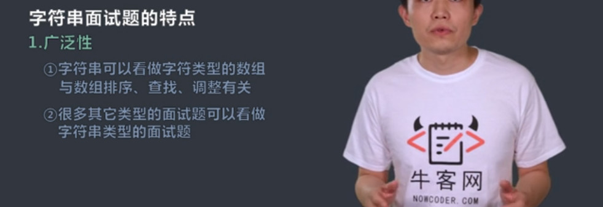

<!--more-->

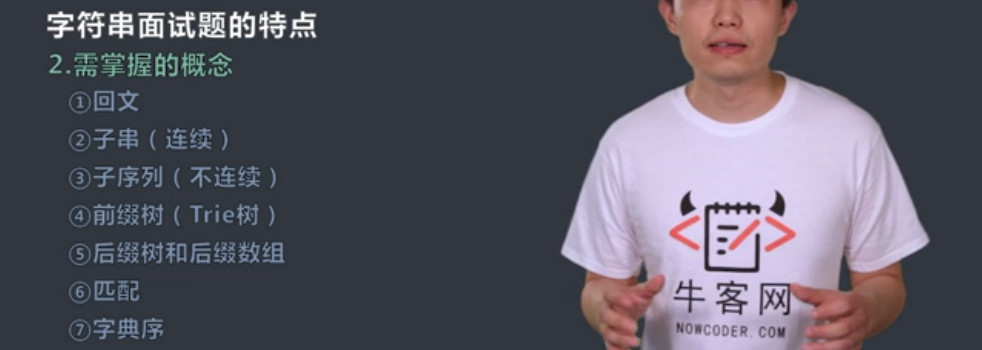

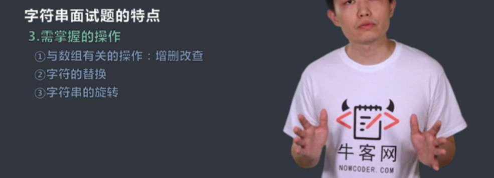
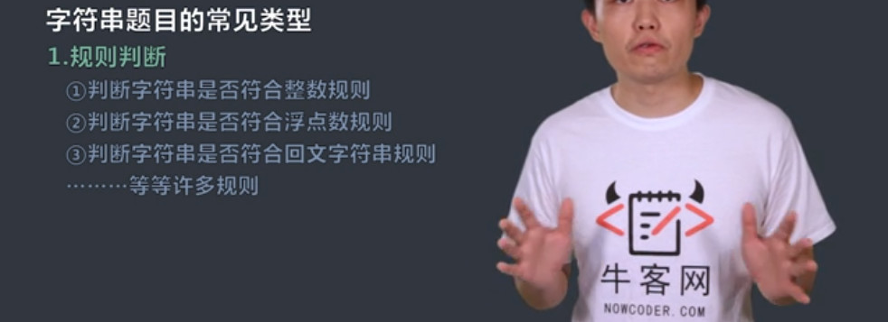
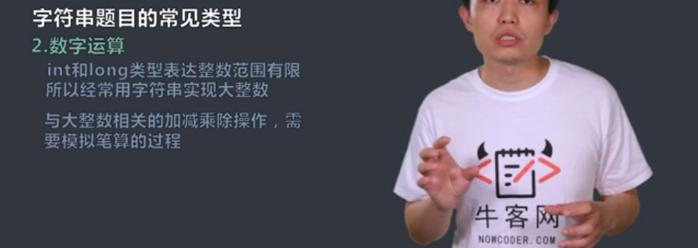
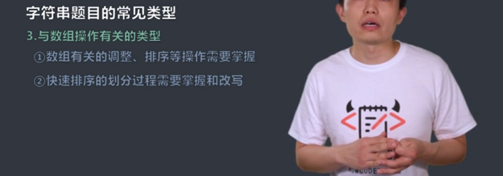
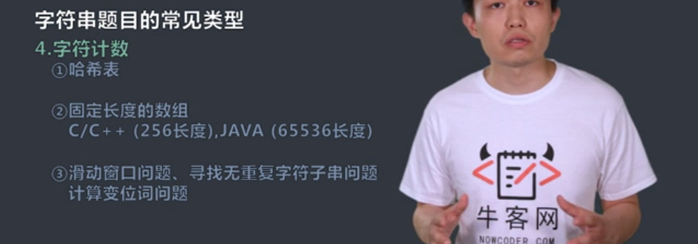
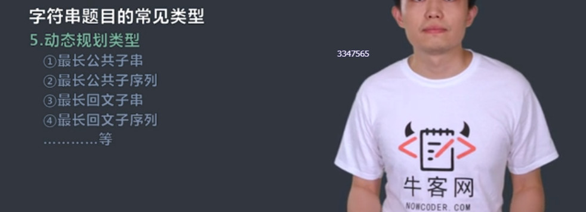
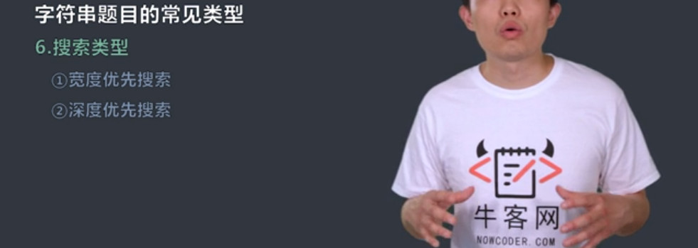
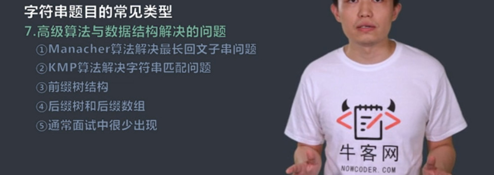
## 拓扑结构相同的子树
`题目`
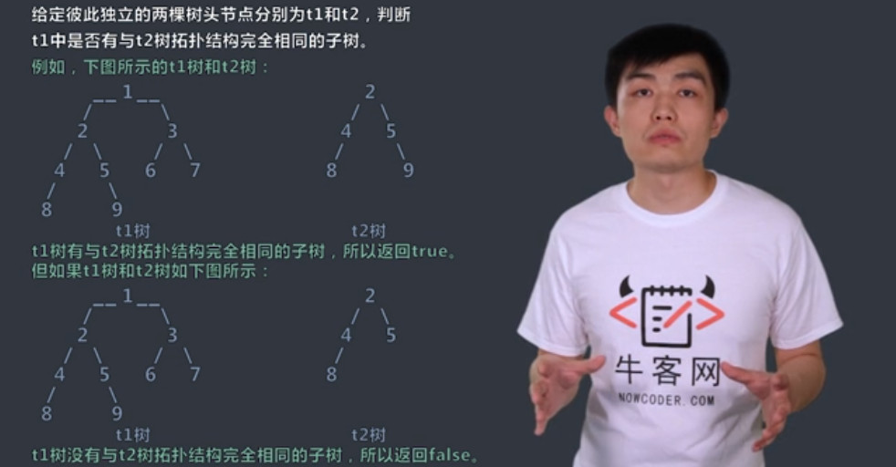
`普通过程`

`最优过程`
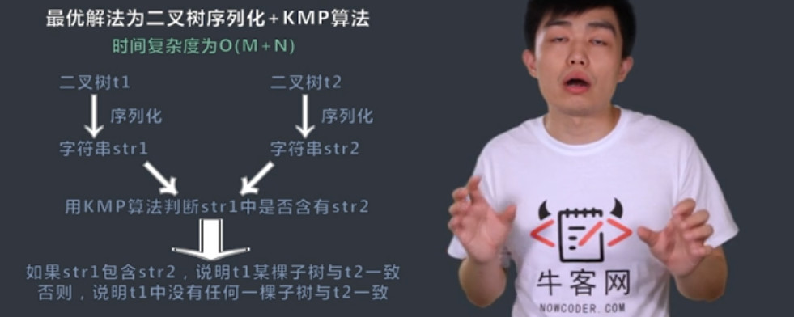
`代码`
```c++
/*
struct TreeNode {
    int val;
    struct TreeNode *left;
    struct TreeNode *right;
    TreeNode(int x) :
            val(x), left(NULL), right(NULL) {
    }
};*/

class IdenticalTree {
public:
    bool chkIdentical(TreeNode* A, TreeNode* B) {
        // write code here
    }
};
```
## 词语变形练习
`题目`
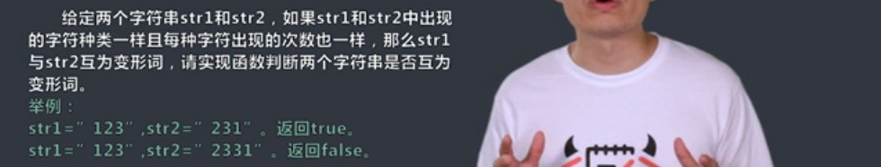

`过程`
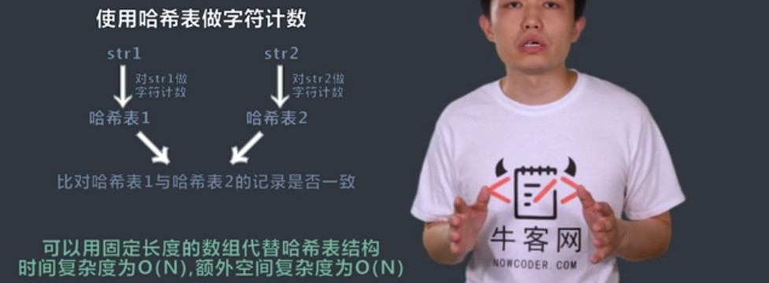

`代码`
```c++
class Transform {
public:
    bool chkTransform(string A, int lena, string B, int lenb) {
        // write code here
        if(lena!=lenb) return false;
        int hashA[256]={0};
        int hashB[256]={0};
        int i;
        for(i=0 ;i<lena;i++){
            hashA[A[i]]++;
        }
        for(i=0;i<lenb;i++){
            hashB[B[i]]++;
        }
        for(i=0;i<256;i++){
            if(hashA[i]!=hashB[i])return false;
        }
        return true;
    }
};
```
# 字符串（二）习题

## 两串旋转练习题
`题目`
给定两个字符串，把字符串str前面任意部分挪到后面去形成的字符串叫做str的旋转词。比如str="1234"，str的旋转词为"1234"，"2341"，"3412"，"4123"。给定两个字符串a和b，请判断a和b是否互为旋转词
- 1、a="cdab"，b="abcd"，返回true
- 2、a="1ab2"，b="ab12"，返回false
- 3、a="2ab1"，b="ab12"，返回true
>输入："cdab",4,"abcd",4
>返回：true

`过程`
最优解为O(n)
- 1、判断str1和str2是否程度相等
- 2、如果长度相等，生成str1+str2大字符串
- 3、用KMP算法判断大字符串中是否含有str2

`代码`
```c++
class Rotation {
public:
    bool chkRotation(string A, int lena, string B, int lenb) {
        // write code here
        if(lena!=lenb)return false;
        A+=A;
        if(A.find(B)!=-1)return true;
        return false;
    }
};
```
## 句子的逆序练习题
`题目`
给定一个字符串str，请在单词间做逆序调整
举例：
"pig loves dog"逆序成"dog loves pig"
>输入："cdab",4,"abcd",4
>返回：true

`过程`
- 1、实现将字符串局部所有字符逆序的函数f
- 2、利用f将字符串所有字符逆序
     "pig loves dog"-->"god sevol gip"
- 3、找到逆序后的字符串中每一个单词的区域，利用f将每一个单词的区域逆序。

`代码`
```c++
class Reverse {
public:
    string reverseSentence(string A, int n) {
        // write code here
        int i,j;
        for(i=0;i<n;i++){
            j=i;
            while(j<n&&A[j]!=' '){
                j++;
            }
            reverse(A, i,j-1);
            i=j;
        }
        reverse(A,0,n-1);
        return A;
    }
    void reverse(string &A, int i, int j){
        char t;
        while(i<j){
            t=A[i];
            A[i]=A[j];
            A[j]=t;
            i++;j--;
        }
    }
};
```
## 字符串移位练习题
`题目`
给定一个字符串str，和一个整数i。i代表str中的位置。将str[0...i]移到右侧，str[i+1...n-1]移到左侧。
举例：str="abcde"，i=2。将str调整为"deabc"。
>输入："ABCDE",5,3
>返回："DEABC"

`过程`
- 1、将str[0...i]字符做逆序调整。
- 2、将str[i+1...n-1]字符做逆序调整
- 3、将整个字符做逆序调整

`代码`
```c++
class Translation {
public:
    string stringTranslation(string A, int n, int len) {
        // write code here
        reverse(A,0,len-1);
        reverse(A,len,n-1);
        reverse(A,0,n-1);
        return A;
    }
    void reverse(string &A, int i, int j){
        char t;
        while(i<j){
            t=A[i];
            A[i]=A[j];
            A[j]=t;
            i++;j--;
        }
    }
};
```
## 拼接最小字典序练习题
`题目`
给定一个字符串数组strs，请找到一种拼接顺序，使得所有字符串拼接起来组成的打字符串所有可能性中字典顺序最小的，并返回这个大字符串。
举例：
- strs=["abc"，"de"]，可以拼接成"abcde"，也可以拼接成"deabc",返回"abcde" 
- strs=["b"，"ba"]，可以拼接成"bba"，也可以拼接成"bab",返回"bab"

>输入：["abc","de"],2
>返回："abcde"

`过程`

- 字符串str1和str2按照如下方式比较排序：
如果str1+str2<str2+str1，则str1放在前面，否则str2放在前面

`代码`
```c++
class Prior {
public:
    string findSmallest(vector<string> strs, int n) {
        // write code here
        string ret;
        sort(strs.begin(),strs.end(),cmp);
        for(int i =0;i<n;i++){
            ret+=strs[i];
        }
        return ret;
    }
    static bool cmp(string A, string B){
        return (A+B)<(B+A);
    }
};
```

## 空格替换练习题
`题目`
请编写一个方法，将字符串中的空格全部替换为“%20”。假定该字符串有足够的空间存放新增的字符，并且知道字符串的真实长度(小于等于1000)，同时保证字符串由大小写的英文字母组成。
给定一个string iniString 为原始的串，以及串的长度 int len, 返回替换后的string。

>输入："Mr John Smith”,13
>返回："Mr%20John%20Smith"
>输入：”Hello  World”,12
>返回：”Hello%20%20World”

`过程`
- 统计空格的数量，将字符串的长度加上2倍的空格数量，得到替换后的总长度
- 从字符串末端开始移位，如果遇到空格，将空格替换为%20
- 如果没遇到空格，将原字符移动到尾端指针


`代码`
```c++
class Replacement {
public:
    string replaceSpace(string iniString, int length) {
        // write code here
            int countSpace = countspace(iniString, length);
        if (countSpace == 0)return iniString;
        iniString.insert(iniString.size(), 2 * countSpace, ' ');
        int countLength = iniString.length() - 1;
        for (int i = length - 1; i >= 0; i--) {
            if (iniString[i] == ' ') {
                iniString[countLength--] = '0';
                iniString[countLength--] = '2';
                iniString[countLength--] = '%';
            } else {
                iniString[countLength--] = iniString[i];
            }
        }
        return iniString;
    }

    int countspace(string iniString, int length) {
        int count = 0;
        for (int i = 0; i < length; i++) {
            if (iniString[i] == ' ')count += 1;
        }
        return count;
    }
};
```

## 合法括号序列判断练习题
`题目`
对于一个字符串，请设计一个算法，判断其是否为一个合法的括号串。
给定一个字符串A和它的长度n，请返回一个bool值代表它是否为一个合法的括号串。

>输入："()())",6
>返回：true
>输入："()(()()",7
>返回：false

`过程`
- 从头到尾遍历，如果遇到左括号，num++；如果遇到右括号，num--；
- 返回 num==0；

`代码`
```c++
class Parenthesis {
public:
    bool chkParenthesis(string A, int n) {
        // write code here
        int num=0;
        for(int i=0;i<n;i++){
            if(A[i]=='('){
                num++;
                continue;
            }
            if(A[i]==')'){
                num--;
                continue;
            }
        }
        return num==0;
    }
};
```

## 最长无重复字符子串练习题
`题目`
对于一个字符串,请设计一个高效算法，找到字符串的最长无重复字符的子串长度。
给定一个字符串A及它的长度n，请返回它的最长无重复字符子串长度。保证A中字符全部为小写英文字符，且长度小于等于500。

>输入："aabcb",5
>返回：3

`过程`


`代码`
```java
import java.util.*;

public class DistinctSubstring {
	public int longestSubstring(String A, int n) {
		if (A == null || n == 0) {
			return 0;
		}
		char[] chas = A.toCharArray();
		int[] map = new int[256];
		for (int i = 0; i < 256; i++) {
			map[i] = -1;
		}
		int len = 0;
		int pre = -1;
		int cur = 0;
		for (int i = 0; i < n; i++) {
			pre = Math.max(pre, map[chas[i]]);
			cur = i - pre;
			len = Math.max(len, cur);
			map[chas[i]] = i;
		}
		return len;
	}
}
```