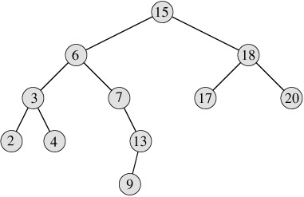
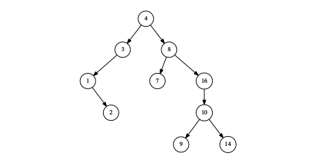

## 二叉搜索树,数据结构中的"hello world"
我们使用二叉搜索树(BST)作为数据结构中的“hello world”。Jon Bentley在他的《编程珠玑》一书中,曾给了这样一个有趣的题目:如何统计一段文字中每个单词出现的次数?下面的C++程序展示了一个解法。
```C++
int main(int, char∗∗ ){
    map<string, int> dict;
    string s;
    while(cin>>s)
        ++dict[s];
    map<string, int>::iterator it=dict.begin();
    for(; it!=dict.end(); ++it)
        cout<<it->first<<": "<<it->second<<"λn";
}
```
 <!--more-->  
 
C++标准库中提供的map是一种用平衡二叉树实现的字典数据结构。例子中用单词作为key,用单词出现的次数作为值。  
一棵`二叉搜索树`是一棵满足下面条件的二叉树:
- 所有左侧分支的值都小于本节点的值,
- 本节点的值小于所有右侧分支的值。  


### 节点数据结构
```c++
template<class T>
struct node{
    node(T x):key(x), left(0), right(0), parent(0){}
    ~node(){
        delete left;
        delete right;
    }
    node∗ left;
    node∗ right;
    node∗ parent; //Optional, it's helpful for succ and pred
    T key;
};
```

### 插入
我们可以使用下述算法向一个二叉搜索树中插入一个键k(在实际应用中,有时会同时插入一对键和值):
- 如果树为空,创建一个叶子节点,令该节点的key = k;
- 如果k小于根节点的key,将它插入到左子树中;
- 如果k大于根节点的key,将它插入到右子树中。

### 遍历
遍历是指依次访问二叉树中的每个元素。有三种遍历方法,分别是前序遍历、中序遍历和后序遍历。它们是按照访问根节点和子节点的先后顺序命名的。
- 前序遍历:先访问key,然后访问左子树,最后访问右子树;
- 中序遍历:先访问左子树,然后访问key,最后访问右子树;
- 后序遍历:先访问左子树,然后访问右子树,最后访问key。

所有的“访问”操作都是递归的。先访问根后访问子分支称为先序,在访问左右分支的中间访问根称为中序,先访问子分支后访问根称为后序。对于图中的二叉树,下面分别列出了三种遍历的结果:
- 前序遍历:4, 3, 1, 2, 8, 7, 16, 10, 9, 14;
- 中序遍历:1, 2, 3, 4, 7, 8, 9, 10, 14, 16;
- 后序遍历:2, 1, 3, 7, 9, 14, 10, 16, 8, 4。  

对二叉搜索树进行中序遍历,元素就会按照从小到大的顺序输出。
中序遍历的算法可以描述为:
- 如果树为空,则返回;
- 否则先中序遍历左子树,然后访问key,最后再中序遍历右子树。

### 搜索
#### Look up
二叉搜索树的定义使得它非常适合进行元素的搜索。可以按照下面描述的方法在树中搜索一个key:
- 如果树为空,搜索失败;
- 如果根节点的key等于待搜索的值,搜索成功,返回根节点作为结果;
- 如果待搜索的值小于根节点的key,继续在左子树中递归搜索;
- 否则,待搜索的值大于根节点的key,继续在右子树中递归搜索。  

```c++
template<class T>
node<T>∗ search(node<T>∗ t, T x){
    while(t && t->key!=x){
    if(x < t->key) t=t->left;
        else t=t->right;
    }
    return t;
}
```
#### 最小元素和最大元素
为了获取最小元素,我们可以不断向左侧前进,直到左侧分支为空。类似地,我们可以通过不断向右侧前进获取最大元素。
#### 前驱(Successor)和后继(predecessor)
给定元素x,它的后继元素y是满足y > x的最小值。有两种情况:如果x所在的节点有一个非空的右子树,则右子树中的最小值就是答案。如图所示,8的后继元素为9,它是元素8的右子树中的最小值。另外一种情况是,如果x没有非空的右子树,我们需要向上回溯,找到最近的一个祖先,使得该祖先的左侧孩子,也为x的祖先。元素2所在的节点没有右侧分支,我们向上回溯一步找到元素1,但是1没有左侧分支,因此需要继续向上查找,这次我们到达了元素3所在的节点。而3的左侧孩子,同样也是2的祖先。至此,我们找到了2的后继元素3。

```python
def succ(x):
    if x.right is not None: return tree_min(x.right)
    p = x.parent
    while p is not None and p.left != x:
        x = p
        p = p.parent
    return p
def pred(x):
    if x.left is not None: return tree_max(x.left)
    p = x.parent
    while p is not None and p.right != x:
        x = p
        p = p.parent
    return p
```

### 代码如下：
```c++
#include <iostream>
#include <vector>
#include <sstream>
//#include <boost/lambda/lambda.hpp>

template<class T>
struct node{
    node(T x):key(x), left(0), right(0), parent(0){}
    ~node(){ // for convinient, use functional approach
        delete left;
        delete right;
    }

    node* left;
    node* right;
    node* parent; //parent is optional, it's helpful for succ/pred
    T key;
};

// in-order tree walk
// easy implemented by using functional approach
template<class T, class F>
void in_order_walk(node<T>* t, F f){
    if(t){
        in_order_walk(t->left, f);
        f(t->key);
        in_order_walk(t->right, f);
    }
}

template<class T>
node<T>* search(node<T>* t, T x){
    while(t && t->key!=x){
        if(x < t->key) t=t->left;
        else t=t->right;
    }
    return t;
}

template<class T>
node<T>* min(node<T>* x){
    while(x && x->left)
        x = x->left;
    return x;
}

template<class T>
node<T>* max(node<T>* x){
    while(x && x->right)
        x = x->right;
    return x;
}

template<class T>
node<T>* succ(node<T>* x){
    if(x){
        if(x->right) return min(x->right);
        //find an ancestor, whose left child contains x
        node<T>* p = x->parent;
        while(p && p->right==x){
            x = p;
            p = p->parent;
        }
        return p;
    }
    return 0;
}

template<class T>
node<T>* pred(node<T>* x){
    if(x){
        if(x->left) return max(x->left);
        //find an ancestor, whose right child contains x
        node<T>* p = x->parent;
        while(p && p->left==x){
            x = p;
            p = p->parent;
        }
        return p;
    }
    return 0;
}

template<class T>
node<T>* insert(node<T>* tree, T key){
    node<T>* root(tree);
    node<T>* x = new node<T>(key);
    node<T>* parent(0);
    while(tree){
        parent = tree;
        if(key < tree->key)
            tree = tree -> left;
        else //assert there is no duplicated key inserted.
            tree = tree -> right;
    }
    x->parent = parent;
    if( parent == 0 ) //tree is empty
        return x;
    else if( key < parent->key)
        parent->left = x;
    else
        parent->right = x;
    return root;
}

// cut the node off the tree, then delete it.
// it can prevent dtor removed children of a node
template<class T>
void remove_node(node<T>* x){
    if(x)
        x->left = x->right = 0;
    delete x;
}

// The algorithm described in CLRS isn't used here.
// I used the algorithm as below (refer to Annotated STL, P 235 (by Hou Jie)
//   if x has only one child: just splice x out
//   if x has two children: use min(right) to replace x
// @return root of the tree
template<class T>
node<T>* del(node<T>* tree, node<T>* x){
    if(!x)
        return tree;

    node<T>* root(tree);
    node<T>* old_x(x);
    node<T>* parent(x->parent);

    if(x->left == 0)
        x = x->right;
    else if(x->right == 0)
        x = x->left;
    else{
        node<T>* y=min(x->right);
        x->key = y->key;
        if(y->parent != x)
            y->parent->left = y->right;
        else
            x->right = y->right;

        remove_node(y);
        return root;
    }

    if(x)
        x->parent = parent;

    if(!parent)
        root = x; //remove node of a tree
    else
    if(parent->left == old_x)
        parent->left = x;
    else
        parent->right = x;

    remove_node(old_x);
    return root;
}

//for testing
template<class Coll>
node<typename Coll::value_type>* build_tree(const Coll& coll){
    node<typename Coll::value_type>* tree(0);
    for(typename Coll::const_iterator it=coll.begin(); it!=coll.end(); ++it)
        tree = insert(tree, *it);
    return tree;
}

template<class T>
std::string tree_to_str(const node<T>* tree){
    if(tree){
        std::ostringstream s;
        s<<"("<<tree_to_str(tree->left)<<"), "<<tree->key
         <<", ("<<tree_to_str(tree->right)<<")";
        return s.str();
    }
    return "empty";
}

template<class T>
node<T>* clone_tree(const node<T>* t, node<T>* parent=0){
    if(t){
        node<T>* t1 = new node<T>(t->key);
        t1->left = clone_tree(t->left, t1);
        t1->right = clone_tree(t->right, t1);
        t1->parent = parent;
        return t1;
    }
    return static_cast<node<T>*>(0);
}

//test helper

class test{
public:
    test(){
        const int buf[]={15, 6, 18, 3, 7, 17, 20, 2, 4, 13, 9};
        tree = build_tree(std::vector<int>(buf, buf+sizeof(buf)/sizeof(int)));
        std::cout<<tree_to_str(tree);
    }

    ~test(){
        delete tree;
    }

    template<class T> void assert_(std::string msg, T x, T y){
        std::cout<<msg;
        if(x==y)
            std::cout<<x<<" OK.\n";
        else
            std::cout<<x<<"!="<<y<<" Fail.\n";
    }

    void run(){
        test_in_order_walk();
        test_min_max();
        test_search();
        test_succ_pred();
        test_del();
    }

private:

    struct Print{
        template<class T>
        void operator()(T x){ std::cout<<x<<", "; }
    };

    void test_in_order_walk(){
        std::cout<<"\ntest in order walk with print functor: ";
        in_order_walk(tree, Print());
        //this can be simplified by using boost
        //using namespace boost::lambda;
        //in_order_walk(tree, std::cout<<_1<<", ");
    }

    void test_min_max(){
        node<int>* empty(0);
        assert_("min(empty)=", min(empty), empty);
        assert_("min(tree)=", min(tree)->key, 2);
        assert_("max(empty)=",max(empty), empty);
        assert_("max(tree)=", max(tree)->key, 20);
    }

    void test_search(){
        node<int>* empty(0);
        assert_("search empty: ", search(empty, 3), empty);
        std::cout<<"search exist key: "<<tree_to_str(search(tree, 18))<<"\n";
        assert_("search non-exist: ", search(tree, 5), empty);
    }

    void test_succ_pred(){
        node<int>* empty(0);
        assert_("succ 7: ", succ(search(tree, 7))->key, 9);
        assert_("succ 13: ", succ(search(tree, 13))->key, 15);
        assert_("succ 20: ", succ(search(tree, 20)), empty);
        assert_("pred 6: ", pred(search(tree, 6))->key, 4);
        assert_("pred 7: ", pred(search(tree, 7))->key, 6);
        assert_("pred 2: ", pred(search(tree, 2)), empty);
    }

    void test_del_n(int n){
        node<int>* empty(0);
        node<int>* t1=clone_tree(tree);
        t1=del(t1, search(t1, n));
        std::cout<<"del "<<n<<":\n"<<tree_to_str(t1)<<"\n";
        assert_("search after del: ", search(t1, n), empty);
        delete t1;
    }

    void test_del(){
        test_del_n(17);
        test_del_n(7);
        test_del_n(6);
        test_del_n(15);
        test_del_n(1); //try to del a non-exist val
    }
private:
    node<int>* tree;
};

int main(int, char**){
    test().run();
}
```


## 插入排序的进化
```c
void isort(Key∗ xs, int n){
    int i, j;
    for(i=1; i<n; ++i)
        for(j=i-1; j≥0 && xs[j+1] < xs[j]; --j)
            swap(xs, j, j+1);
}
```
### 改进一
任何时刻,我们手中的牌都是已序的,因此我们可以用二分查找来搜索插入位置。
```python
def isort(xs):
    n = len(xs)
    for i in range(1, n):
        x = xs[i]
        p = binary_search(xs[:i], x)
        for j in range(i, p, -1):
            xs[j] = xs[j-1]
        xs[p] = x

def binary_search(xs, x):
    l = 0
    u = len(xs)
    while l < u:
        m = (l+u)/2
        if xs[m] == x:
            return m
        elif xs[m] < x:
            l = m + 1
        else:
            u = m
    return l
```
### 使用二叉搜索树的最终改进
```python
function Sort(A)
    T <- φ
    for each x ∈ A do
        T <- Insert-Tree(T, x)
    return To-List(T)
```