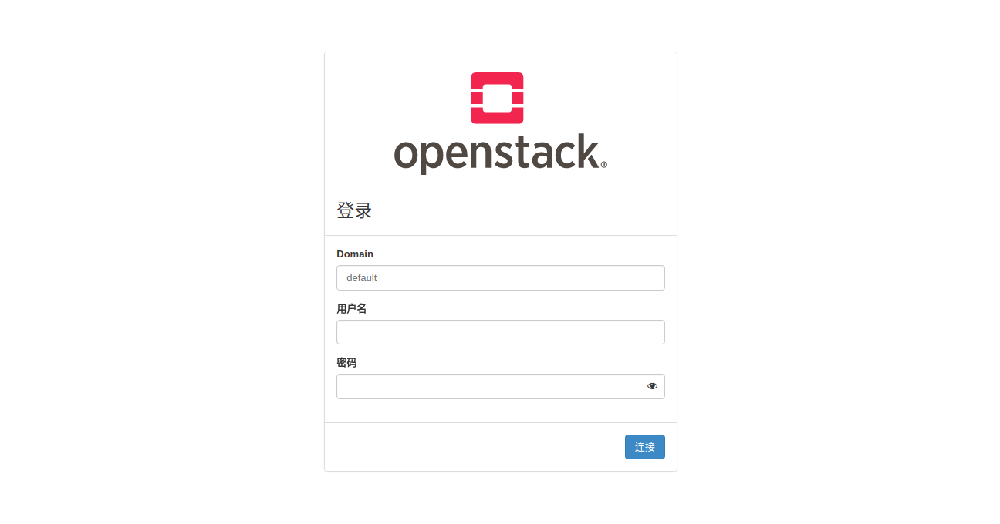

## openstack源代码的获取

我们可以从[***OpenStack Releases***](https://releases.openstack.org/)下载所有发行版本的openstack，openstack每6个月发行一个版本。选择相应的openstac版本和相应组件版本。
<!--more-->


## Horizon UI开发环境部署
这里认为以及部署好一个openstack ocata基础环境，仅演示手动部署horizon ui开发环境

### 开发准备
#### 安装pip
```shell
sudo apt-get install python-pip
sudo apt-get install -y libxml2-dev libxslt1-dev zlib1g-dev python3-pip
```
#### 下载horizon源码:
```shell
git clone https://github.com/openstack/horizon.git
cd horizon/
```
#### 环境配置
```shell
cp openstack_dashboard/local/local_settings.py.example openstack_dashboard/local/local_settings.py
```
vi openstack_dashboard/local/local_settings.py
```python
ALLOWED_HOSTS = '*'
# ...
OPENSTACK_KEYSTONE_DEFAULT_DOMAIN = 'default' # 如果 Domain 的 ID 不是 default，则为对应的 ID  
# ...
OPENSTACK_KEYSTONE_MULTIDOMAIN_SUPPORT = True
# ...
OPENSTACK_HOST = "192.168.89.11" # 控制节点IP地址
OPENSTACK_KEYSTONE_URL = "http://%s:5000/v3" % OPENSTACK_HOST
OPENSTACK_KEYSTONE_DEFAULT_ROLE = "user" #根据你的环境自己配置这个参数，这里我是‘user’
# ...
OPENSTACK_API_VERSIONS = {
  "identity": 3,
  "image": 2,
  "volume": 2,
}
# ...
# 根据你的网络环境配置这里的参数
OPENSTACK_NEUTRON_NETWORK = {
  #...
  'enable_router': False,
  'enable_quotas': False,
  'enable_distributed_router': False,
  'enable_ha_router': False,
  'enable_lb': False,
  'enable_firewall': False,
  'enable_vpn': False,
  'enable_fip_topology_check': False,
}
```
#### django session cache选择
1.依赖安装
```shell
sudo apt-get install memcached
pip install python-memcached
sudo apt-get install python-dev
sudo apt-get install libmemcached-dev
pip install pylibmc
```
2.配置local_setting.py
```python
CACHES = {
   'default': {
       'BACKEND': 'django.core.cache.backends.memcached.MemcachedCache',
       'LOCATION': '127.0.0.1:11211',
   },
}
```
#### 设定hosts
vim /etc/hosts
```python
192.168.89.11 controller
```
#### 压缩静态文件
初始化静态文件 注意：一定要先执行此步骤再启动服务！否则再执行因为缓存还是不能正常运行，需要在 collectstatic 时增加 -c 参数
```python
python manage.py collectstatic -l
python manage.py compress --force
```
#### 语言环境切换
1.修改horizon/openstack_dashboard/locale/zh_CN/LC_MESSAGES/django.po
	注意按照下面的格式
```python
#: templates/403.html:25 templates/404.html:24
msgid "Projects"
msgstr "项目"
```
2.编译
```python
cd horizon/openstack_dashboard
django-admin compilemessages
```
3.done

`注意`：以上的环境为python3.5和pip3


### 运行效果
打开pycharm，加载运行horizon源码，选择编译器版本为python3,安装requirements.txt中的依赖，安装以上步骤配置完成后，点击运行，得到如下效果：


登录进去效果如下:

